## Getting Started
-	Getting started with advertising (this guide)
-	Campaign design guide (still need to be made)
-	Campaign optimization (still need to be made)
-	[Server to server (S2S) Install Tracking](https://github.com/zplayads/Server-to-Server-Install-Tracking/blob/master/Advertiser%20Server%20to%20Server%20Install%20Tracking.md)
-	Advertising stats API (API need to be finished)

## Self-Service User Acquisition
This document will help you get started with User Acquisition campaigns on the ZPLAY Ads platform.
## Outline
Creating an Advertiser Account
Adding a Game
Adding Creative Material
Creating a Campaign
Playable Ad Preview

## Creating an Advertiser Account
The first step to start your user acquisition campaigns with ZPLAY Ads is – believe it or not – to create an account. To do this, follow the quick steps below:
-	Step 1: [Go to ZPLAYAds](https://www.zplayads.com/en/register.html)

-	Step 2: Make sure to select “Promotion” under the Account Type field;
 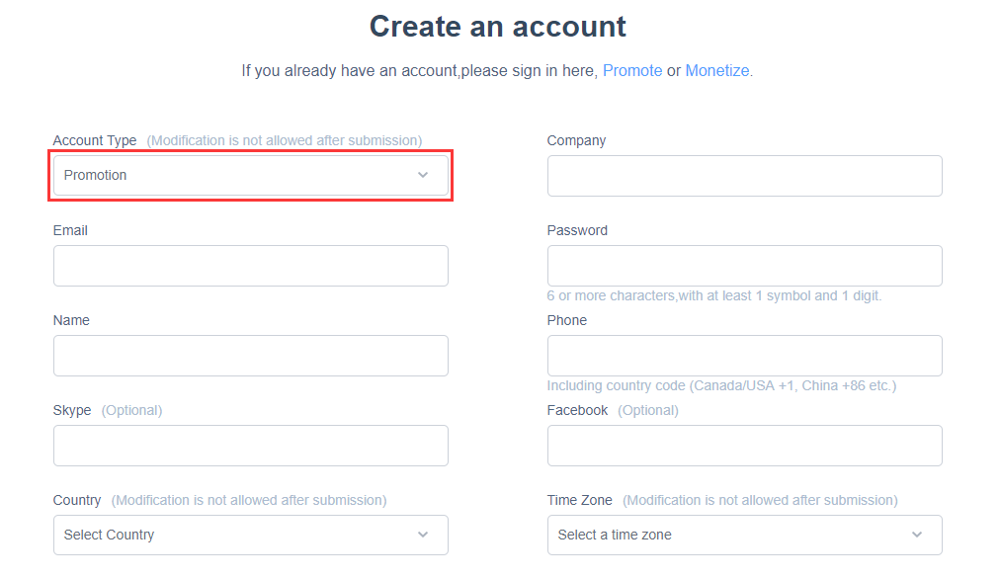
-	Step 3: [Sign in to your account](https://www.zplayads.com/en/login.html)

## Adding a Game
After creating your account, you now need to add your game to the platform. Creative materials and campaigns will be stored within each game promotion profile being created. You will need to create separate game promotion profiles for each of Android and iOS if promoting on both platforms.

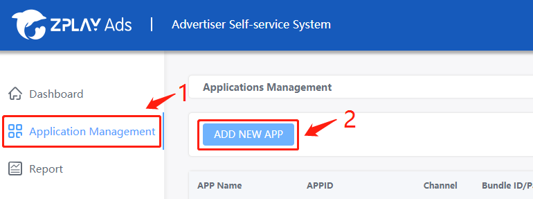
-	Step 1: Select “Application Management” on the left-hand side of the dashboard;

-	Step 2: Click on “ADD NEW APP” to start adding your game;

-	Step 3: Fill the App Creation Form and Submit your App;

-	Step 4: Our team will review and approve your game if everything is correct.

## Adding Creative Material
After your game is approved, you can add the creative materials for the user acquisition campaign. This can be done easily through the following steps:

-	Step 1: Click on the game’s name on the “Application Management” tab;
	
  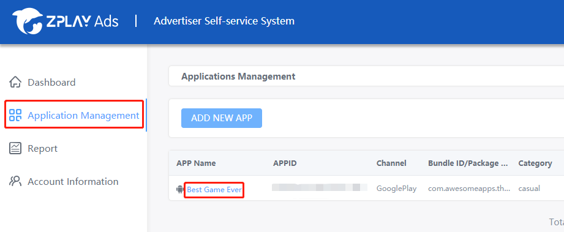
-	Step 2: Select the “AD MATERIAL” ribbon and then click on the “ADD MATERIAL” button.
	
 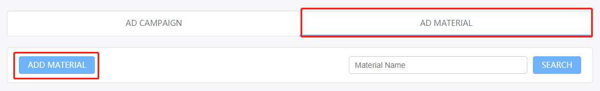
-	Step 3: Fill & submit the material form;

-	Step 4: Our team will review and approve the creative materials if everything is alright. 

## Creating a Campaign
As soon as your creative materials are approved, you can create a campaign inside the game’s profile.

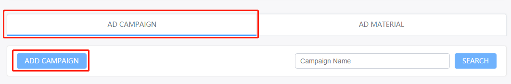 
#### Step 1: Select the “AD CAMPAIGN” tab and click “ADD CAMPAIGN” to start creating your campaign;

#### Step 2: Go through the campaign setup process:
- Campaign Name: The name of this campaign;
- Budget setting: The buying model (cost type), the daily budget (if any), and the fixed CPI cost per install ceiling for the campaign. Campaigns are currently only available on a Cost per Install (CPI) basis. 

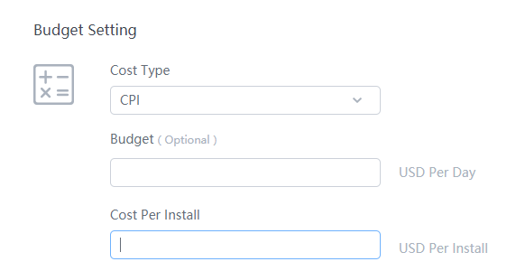  
- Time Setting: When the campaign should start and end. By default, there is no end date.
- Material Setting: Here you will select one of the approved materials you have already submitted.
 
 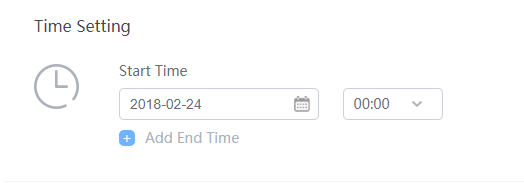 
- Targeting Setting: This allows you to refine your campaign regarding Time, Network, and Geo. By default, no restrictions are selected.

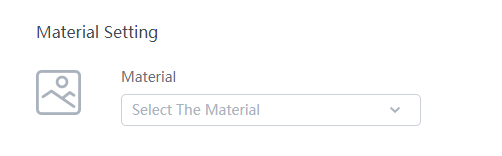 
- Time: Select when you would like your campaign to be active.

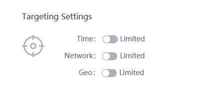 
- Network: Restrict to which type of network your ad should be displayed.

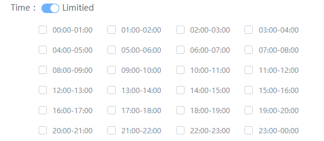 
- Geo: Click on the field to select which countries you would like to focus your campaign on.

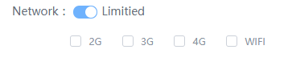 
- Tracking Setting: This is where you will set the tracking URL. Check our [Server to Server Install Tracking article](https://github.com/zplayads/Server-to-Server-Install-Tracking/blob/master/Advertiser%20Server%20to%20Server%20Install%20Tracking.md) for more info .

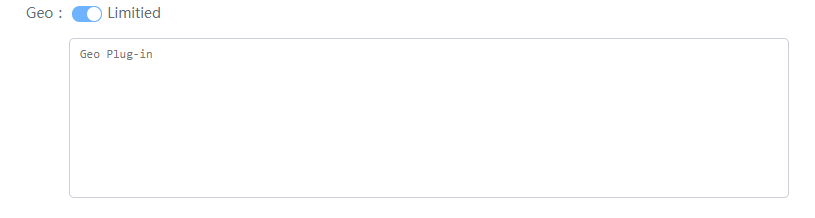 
#### Step 3: After the submission of your campaign, our team will create a playable Ad based on the information provided by you and the campaign will start on the date selected by you. 

## Playable Ad Preview
Before the campaign goes live, you can review the playable Ad that was created. You will be notified via email that the ad was created and you can preview it following the steps below:

#### Step 1: Download ZPLAY Ads’ preview tool 
- [AppStore](https://itunes.apple.com/us/app/zplay-ads-preview-tool/id1296725647)
- [Google Play](https://play.google.com/store/apps/details?id=com.zplay.zplayads)

#### Step 2: Click on “Preview Ad” button on the right side of the ad campaign you’ve created
 
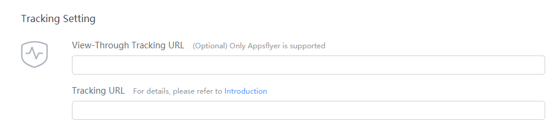 
#### Step 3: Scan the QR code that appears on the top of the preview tool.

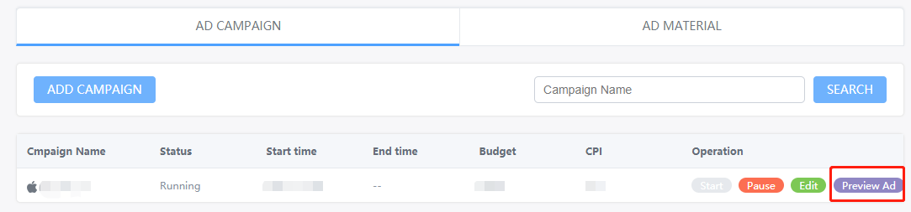 
Note: If you notice any issues with your App’s playable ad, or need a different variation of it made, please contact your account manager.
