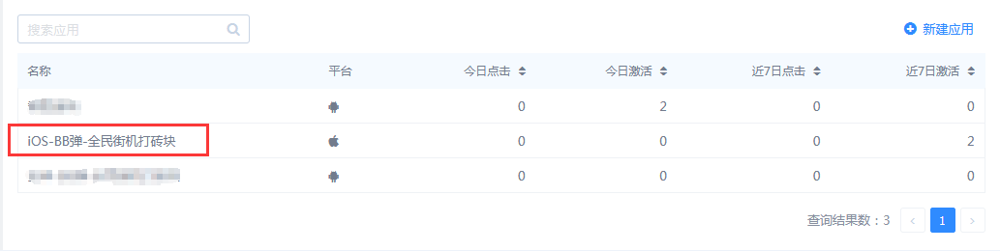
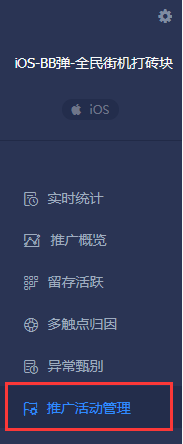
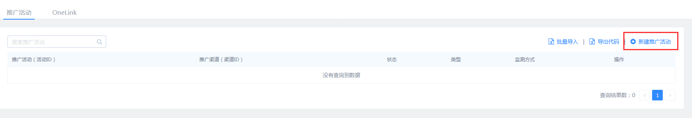
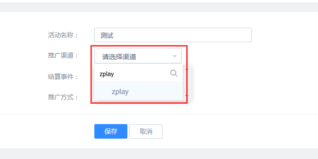
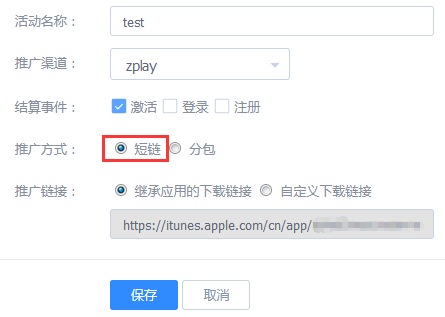
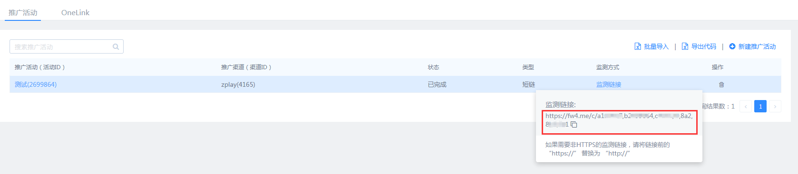
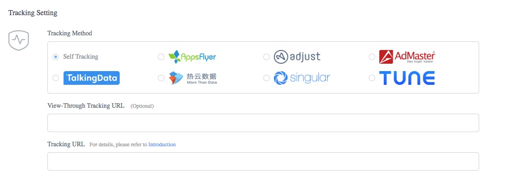

#### 1.	Choose the app you are going to promote in the application list.

#### 2.	Click "推广活动管理" on the left side.

#### 3.	Choose “新建推广活动”。

#### 4.	Search and choose "zplay" in 推广渠道.

#### 5. Choose 短链 in 推广方式. Fill in other fields according to your needs, then click 保存.
推广方式选择“短链”。其他字段根据您的需求填写。填写完成后，点击保存。

#### 6. After adding your promotion activity, you will back to the 推广活动管理 page. Click "监测链接", and you will see your tracking link. Copy this link, and fill it into "Tracking URL" of ZPLAY Ads when you creat campaign and edit campaign on ZPALY Ads platform.

