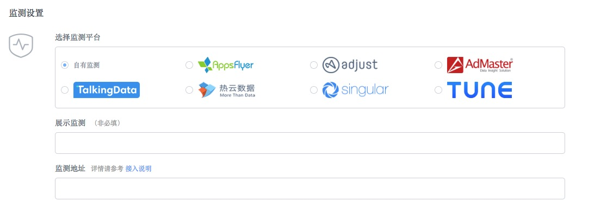

#### 1.	在应用列表中，点击要推广的应用。

#### 2.	点击左侧菜单栏中的“推广活动管理”。

#### 3.	选择“新建推广活动”。

#### 4.	在推广渠道中，搜索“zplay”并选中。

#### 5. 推广方式选择“短链”。其他字段根据您的需求填写。填写完成后，点击保存。

#### 6. 保存后，跳转到列表页。点击“监测链接”，弹出监测链接地址弹窗。点击复制按钮，可复制监测链接。该链接即为在zplay广告主自助系统中创建广告页面里的“监测地址”。

