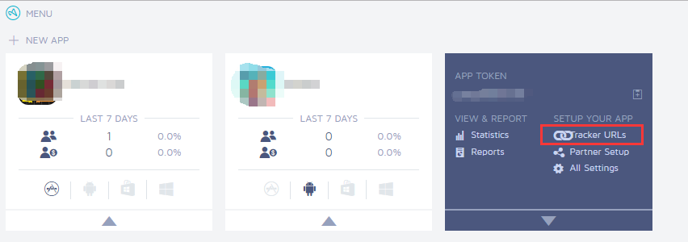
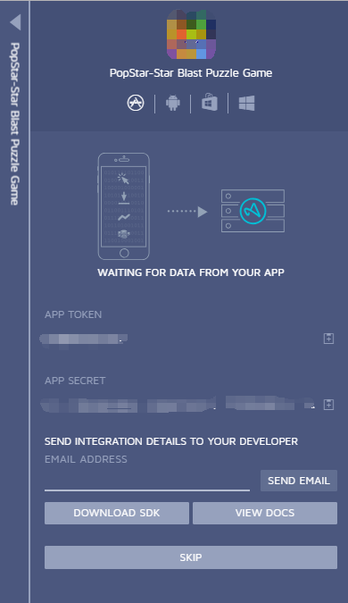
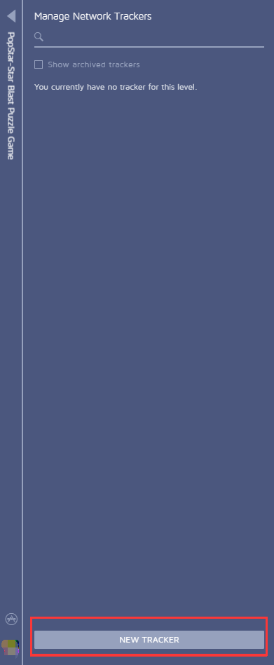
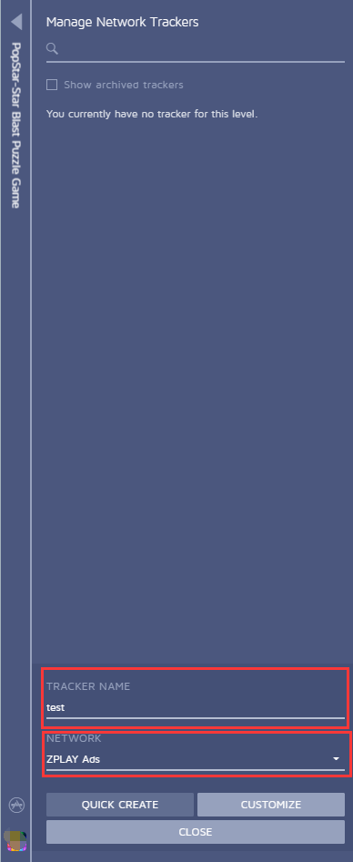
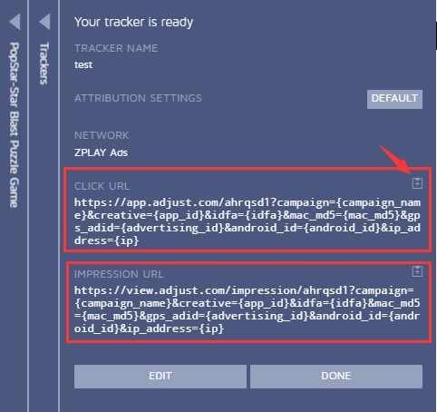

#### 1. Log into your dashboard, choose the app you want promote, choose "Tracker URLs"

#### 2. Click "SKIP" enter the next step and start creating tracking URL
 
#### 3. Select "NEW TRACKER" to create a new tracking URL
 
#### 4. Enter the name for this tracking URL in "TRACKER NAME", select ZPLAY Ads in NETWORK, then select "CUSTOMIZE"
 
#### 5. You can get CLICK URL and IMPRESSION URL in this page
 
#### 6.	When you creat campaign and edit campaign on ZPLAY Ads platform, fill in CLICK URL into "Tracking URL" of ZPLAY Ads, and fill in IMPRESSION URL in "View-Through Tracking URL" of ZPLAY Ads

