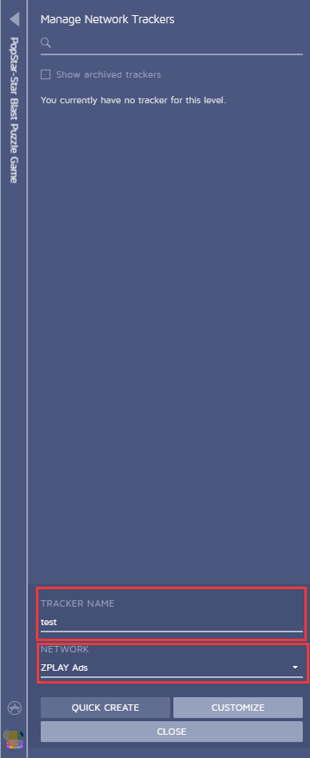
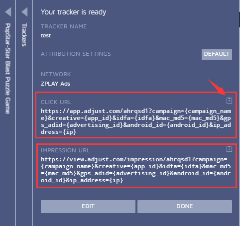
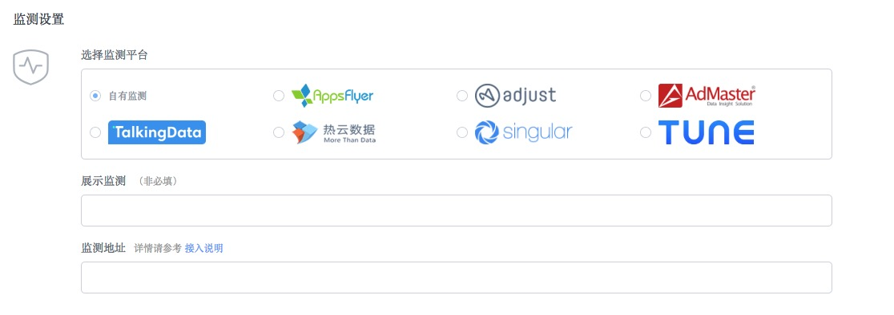

#### 1. 登录您的控制面板，找到您要推广的应用，选择“Tracker URLs”

#### 2. 点击“SKIP”，进入下一步，开始创建监测链接
 
#### 3. 选择“NEW TRACKER”创建新的监测链接
 
#### 4.在TRACKER NAME中输入您创建的监测链接的名称，在NETWORK中选择ZPLAY Ads，选择“CUSTOMIZE”
 
#### 5. 可以获取CLICK URL与IMPRESSION URL
 
#### 6.	在您创建广告或者编辑广告时将获取到的IMPRESSION URL填写到ZPLAY Ads展示监测地址框，CLICK URL填写到ZPLAY Ads的监测地址框内 

