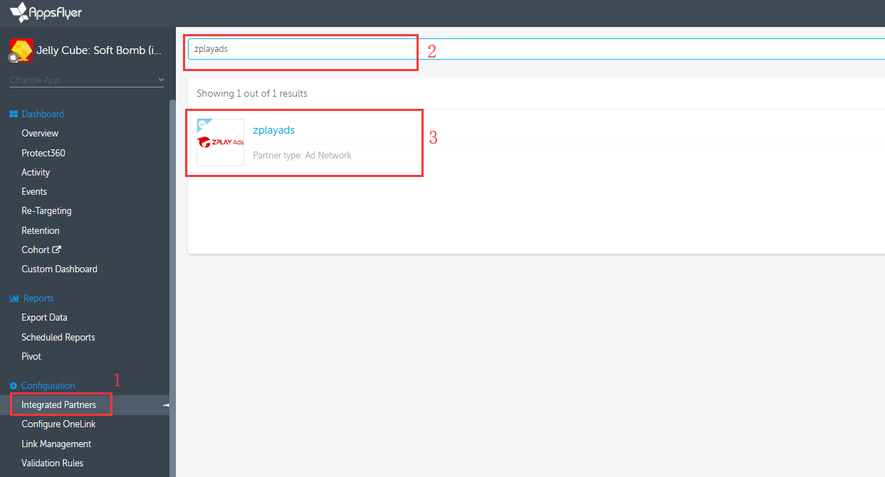
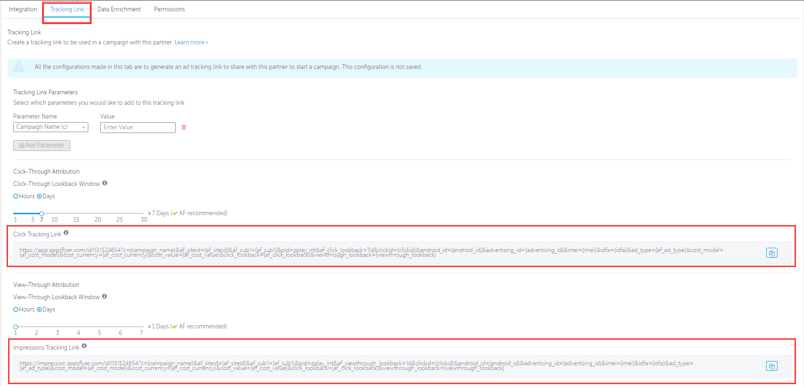

#### 1. Log into your dashboard, choose the app you want promote, select "zplayads" in "Integrated Partner" page, click ZPLAY Ads logo, enter setting page

#### 2. Click 'Tracking Link' tab, You can get your Click Tracking Link and Impression Tracking Link in this page

#### 3.	When you creat campaign and edit campaign on ZPLAY Ads platform, fill in Click Tracking Link into "Tracking URL" of ZPLAY Ads, and fill in Impression Tracking Link in "View-Through Tracking URL" of ZPLAY Ads

