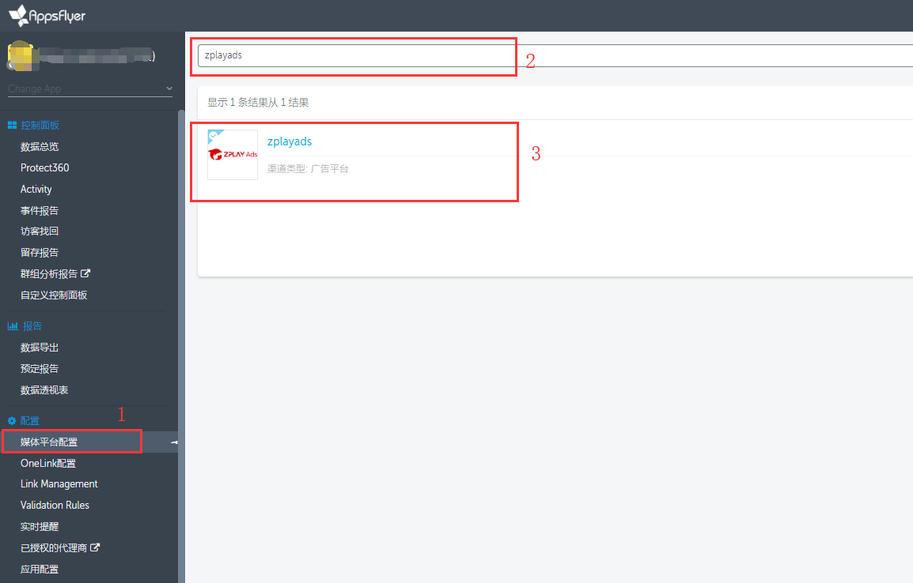
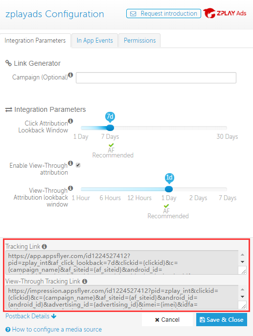
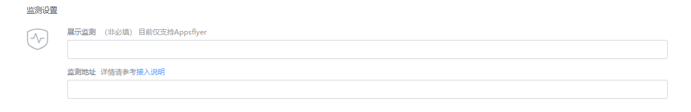

#### 1. Log into your dashboard, choose the app you want promote, select "zplayads" in "Integrated Partner" page, click ZPLAY Ads logo, enter setting page

#### 2. You can get your Tracking Link and View-Tracking Link in this page

#### 3.	When you creat campaign and edit campaign, fill in tracking URL into "Tracking URL" of ZPLAY Ads, and fill in View-through URL in "View-through" of ZPLAY Ads

