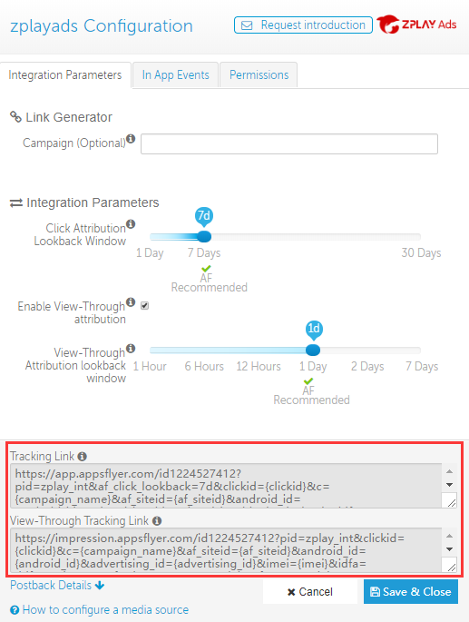

#### 1. 登陆您的控制面板，找到您要推广的应用，进入“媒体平台配置”页面，搜索zplayads，点击zplayads进入平台配置页面

#### 2. 在平台配置页面获取Tracking Link及View-Tracking Link

#### 3.	在您创建广告或者编辑广告将获取到的View-Tracking Link填写到ZPLAY Ads展示监测地址框，Tracking Link填写到ZPLAY Ads的监测地址框内 

