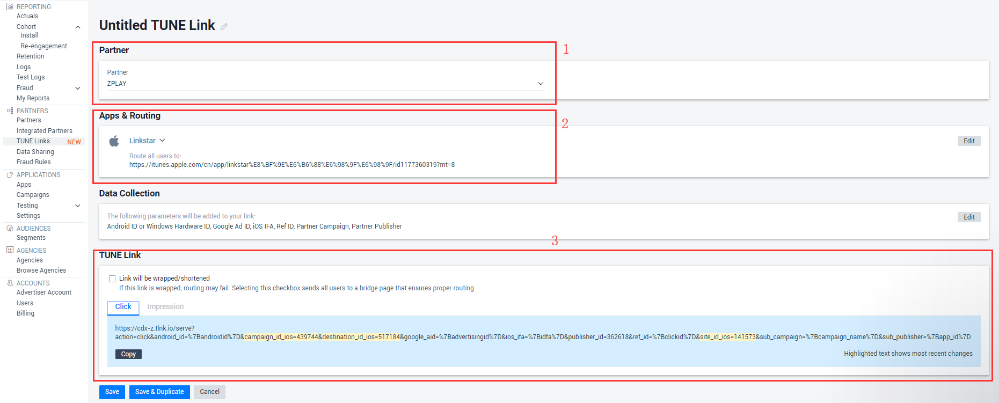
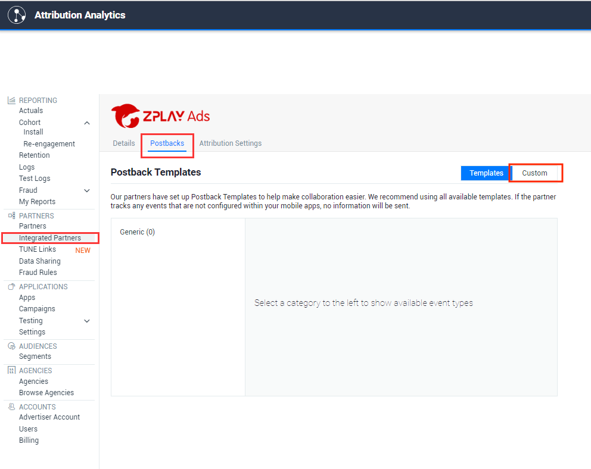

#### 1.	Enter the Integrated Partners page of the PARTNERS directory

#### 2.	Search ZPLAY in search box

#### 3.	Set ZPLAY partner to ENABLED status  

#### 4.	Click ZPLAY Ads logo enter setting page, choose "Creat New"
 

#### 5.	Select the application you want to promote in APP & Routing

#### 6.	You can get the Click URL and Impression URL in TUNE Link, click “Save&Duplicate” to copy and save it, as below

#### 7.In ZPLAY Ads settings page, click "Postback"->"Custom" to set postback setting,  if you don't do this step, ZPLAY Ads will not receive install data

#### 8.Set postback setting, as below

#### 9.	Fill in tracking URL into "Tracking URL" of ZPLAY Ads when you creat campaign or edit campaign

