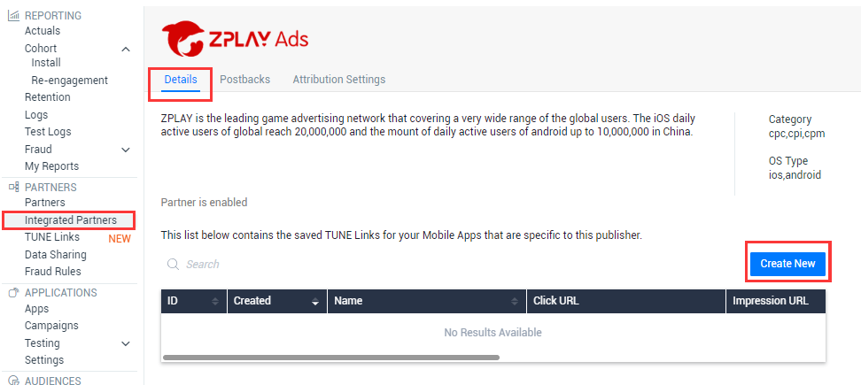
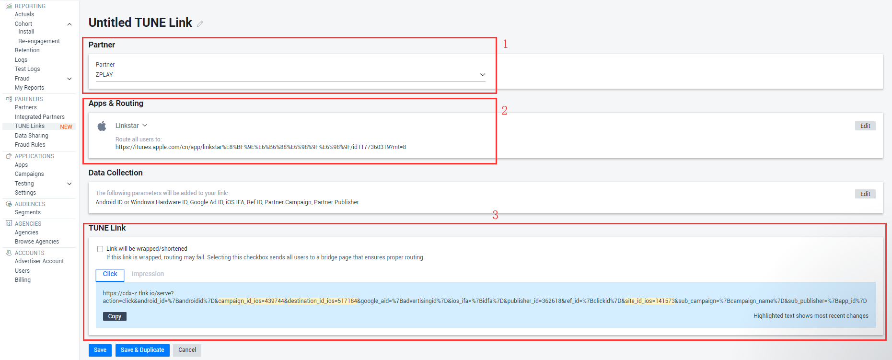
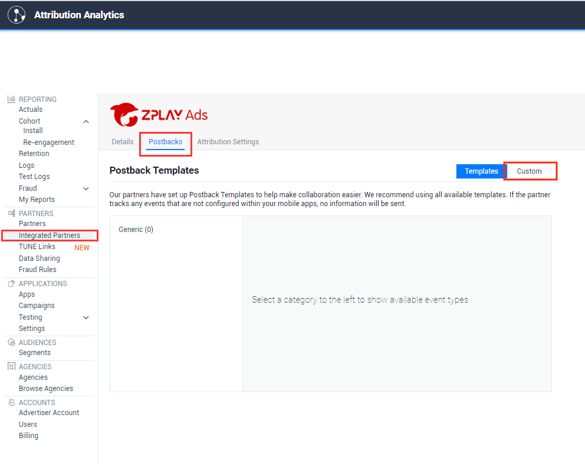
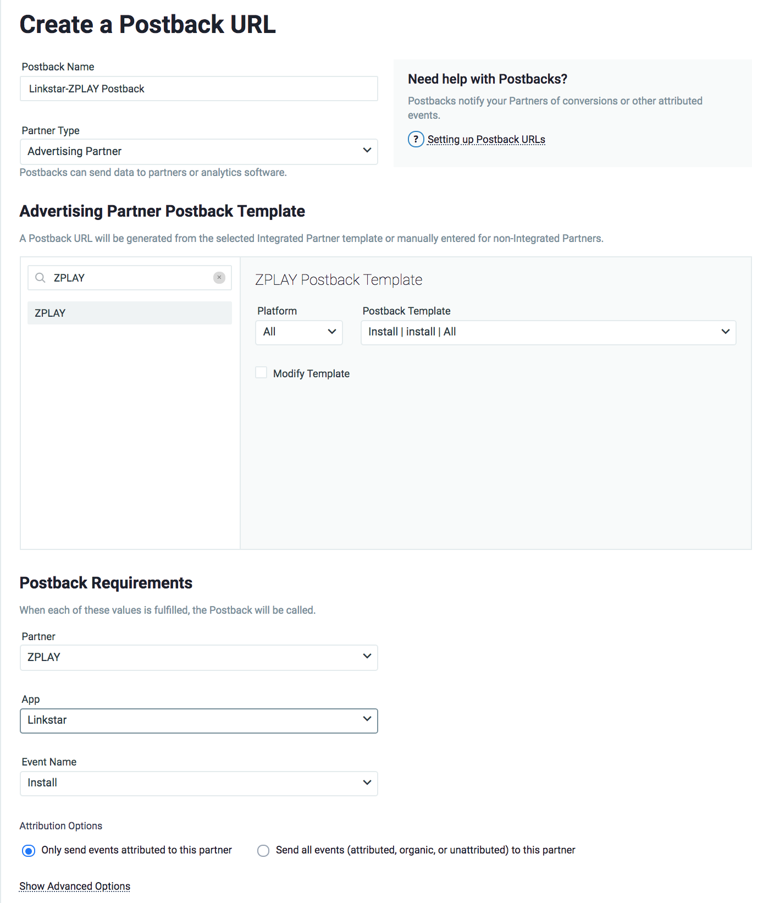

#### 1.	进入PARTNERS目录下Integrated Partners页面

#### 2.	在搜索框中输入ZPLAY进行搜索

#### 3.	将搜索到的ZPLAY Ads状态置为Partner is enabled  

#### 4.	点击ZPLAY Ads的logo进入ZPLAY Ads设置，选择“Create New”
 

#### 5.	在APP & Routing中选择您要推广的应用

#### 6.	您可以在TUNE Link中获取Click URL及Impression URL，点击“Save&Duplicate”复制并保存，见下图

#### 7.仍旧在ZPLAY Ads的设置中，选中Postback， 点击Custom进行激活回传设置，若不进行此步骤，ZPLAY Ads将无法收到激活数据

#### 8.按照下图中设置激活回传设置

#### 9.	在您创建广告或者编辑广告时将获取到的Click URL填写到ZPLAY Ads的监测地址框内，将Impression URL填写到ZPLAY Ads的展示监测地址框内

