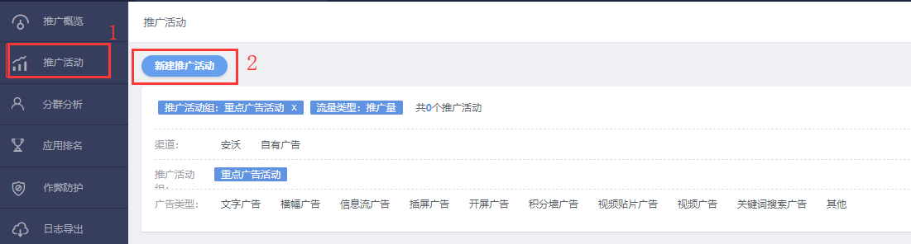
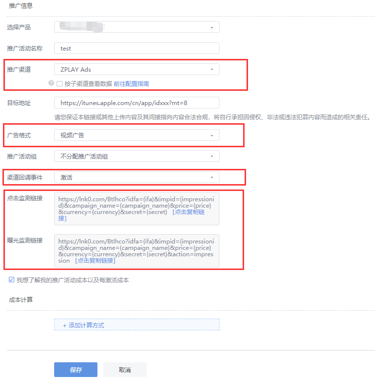
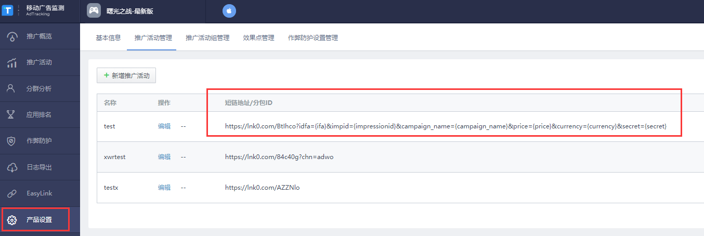

#### 1.	Enter"推广活动"page, choose "新建推广活动"

#### 2.	Select ZPLAY Ads in "推广渠道", select 激活 in "渠道回调事件", you can get your Impression URL(曝光监测链接) and Tracking URL(点击监测链接) in this page

#### 3.	You can also get your link in "产品设置" page

#### 4.	When you creat campaign and edit campaign on ZPALY Ads platform, fill in Tracking URL(点击监测链接) into "Tracking URL" of ZPLAY Ads, and fill in Impression URL(曝光监测链接) into "View-Through Tracking URL" of ZPLAY Ads

