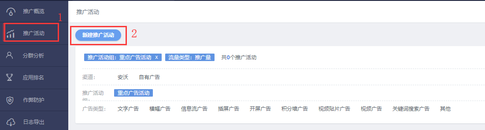
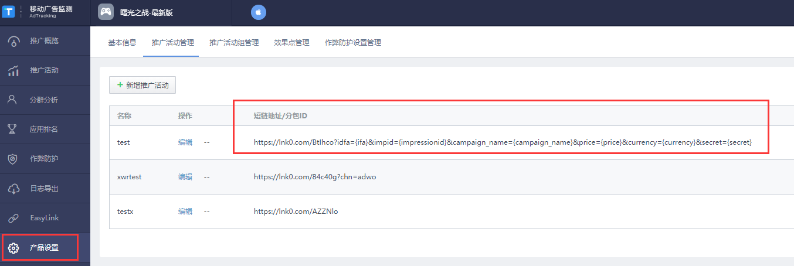

#### 1.	进入推广活动页面，选择“新建推广活动”

#### 2.	在推广渠道中选择ZPLAY Ads，渠道回调事件选择激活，可在页面中获取点击监测链接及曝光监测链接

#### 3.	您同样可在产品设置目录获取到您所保存的链接

#### 4.	在您创建广告或者编辑广告时将获取到的点击监测链接填写到ZPLAY Ads的监测地址框内，将获取到的曝光监测链接填写到ZPALY Ads的展示监测地址框内

