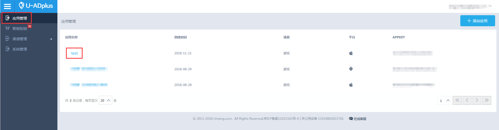
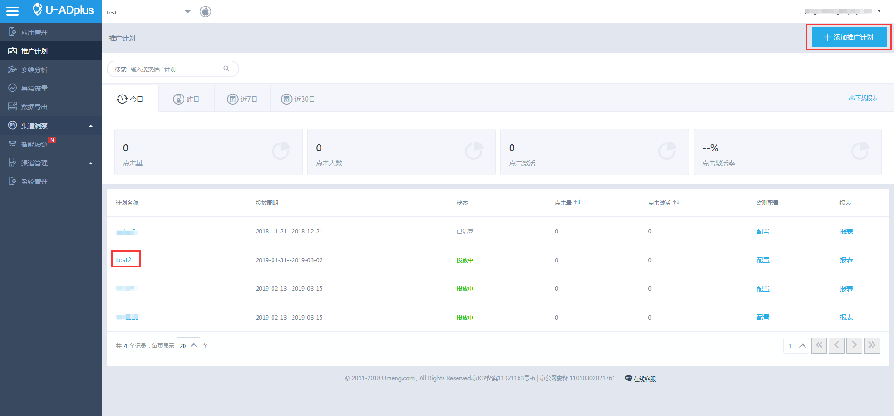
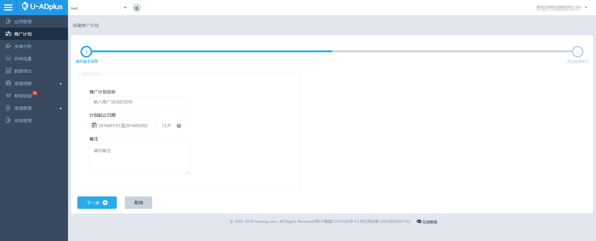
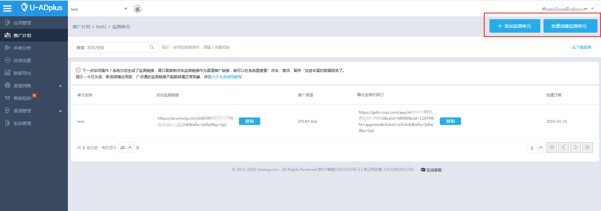
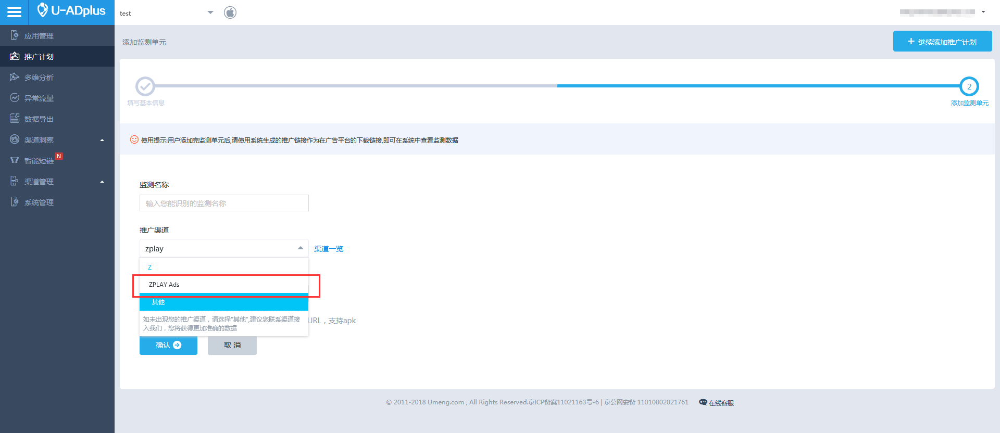
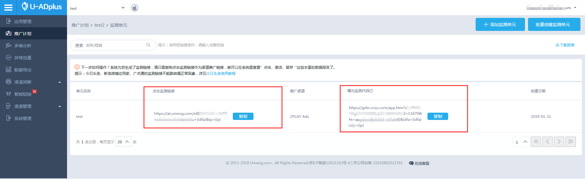
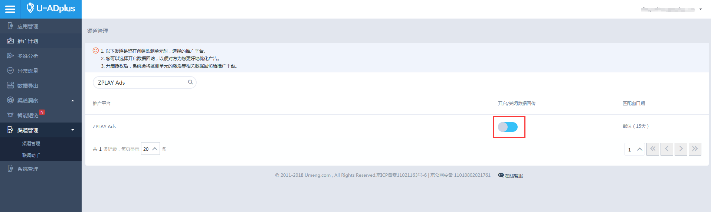
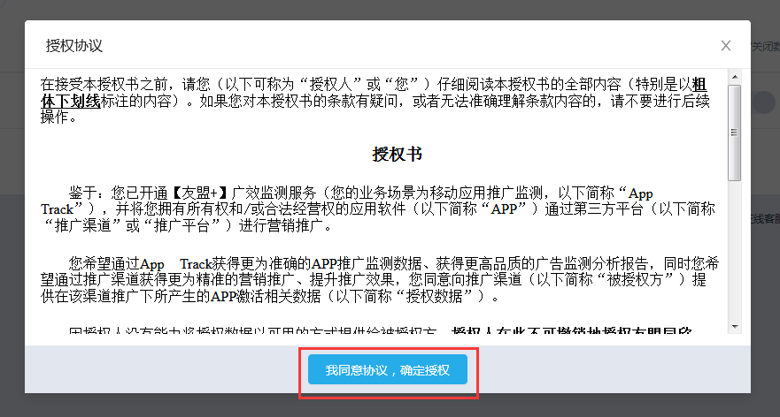
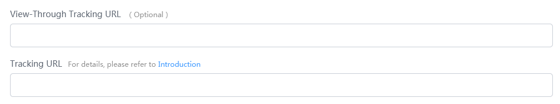

#### 1. Enter “应用管理” page and find the app you are going to promote. Click the app name to enter the promotion plan list of the app. 

#### 2. If you want to create a new promotion plan, click “添加推广计划” button in this page, then move on to step 2.1
#### If you want to add tracking unit for exsited promotion plan, click the name of your plan, then go directly to step 2.2

##### 2.1 Fill in the basic information of the promotion plan according to your demands, then click “下一步” and move to step 3

##### 2.2 In the page of tracking unit list, click “添加监测单元” to add a single tracking unit or click “批量创建监测单元” to add several tracking units. Then, move to step 3

#### 3. Choose "ZPLAY Ads" in the drop-down list of “推广渠道”. After filling in other information, click “确认” button to save your settings

#### 4. After creating a tracking unit, you can copy “点击监测链接” and “曝光监测代码” of the tracking unit in this page

#### 5. Enter “渠道管理” page under “渠道管理” menu and search for "ZPLAY Ads" in the channel list. You need to switch the “开启/关闭数据回传” button on manually. Umeng will not transmit installation data to ZPLAY Ads until you switch this button on

**When you switch the “开启/关闭数据回传” button on, you need to agree with "Authorization agreement". After clicking “我同意协议，确定授权”, the “开启/关闭数据回传” button could be switched on.**

#### 6. In the create campaign or edit campaign page of ZPLAY Ads, fill the Tracking URL with “点击监测链接”. And fill the View-Through Tracking URL with “曝光检测代码”
