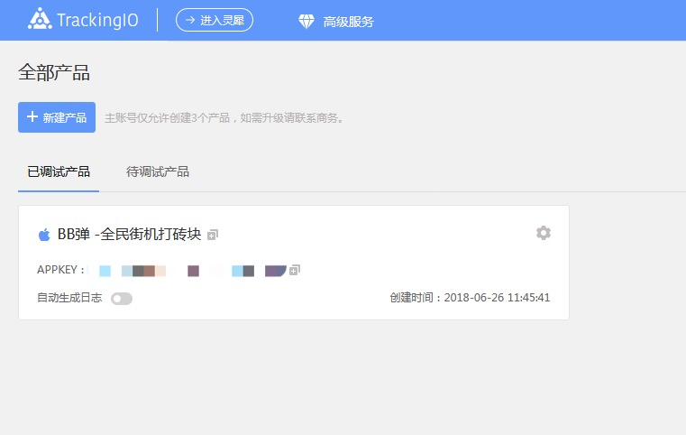
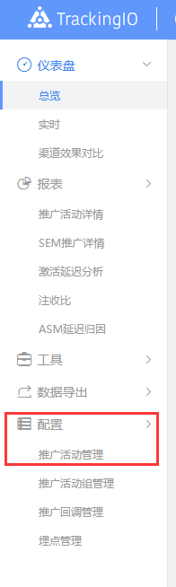
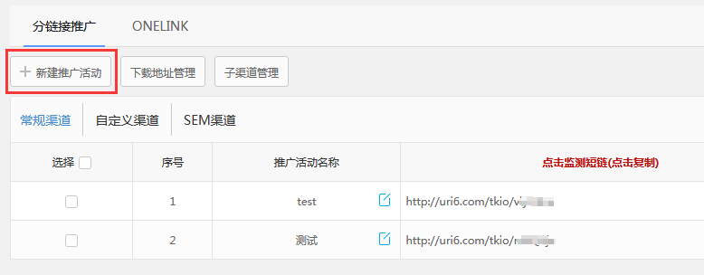
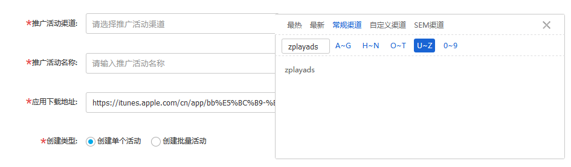
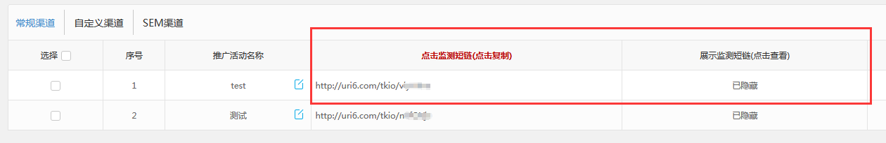

#### 1.	Choose your app in “已调试产品”.

#### 2.	Cilck “配置” on the left side of the page, and then choose “推广活动管理”.

#### 3.	Choose “新建推广活动”.

#### 4.	Choose zplayads in “常规渠道” to fill the 推广活动渠道. Fill in other blanks on base of your demands. Then, click “立即创建”.

#### 5. After creating your promotion, you will see your URLs in this page. Fill in the "Tracking URL" of ZPLAY Ads with the “监测短链” in this table, and the "View-Through URL" of ZPLAY Ads is the same as the “展示监测短链” in this table.

