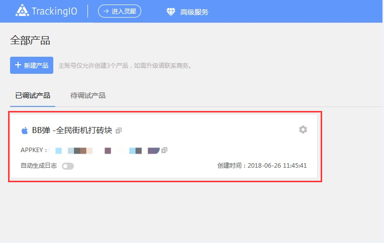
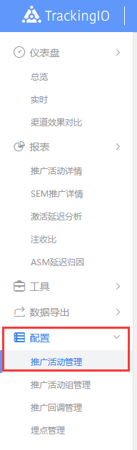
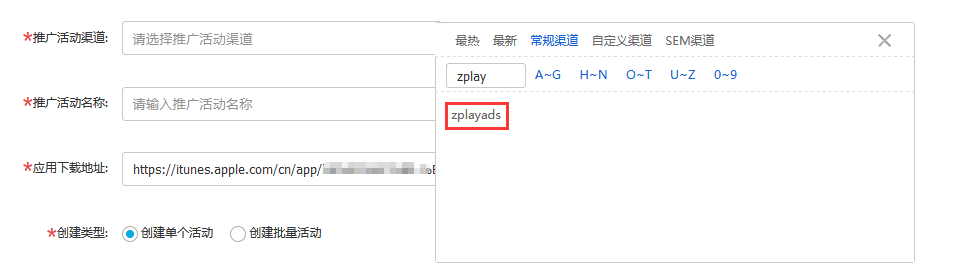

#### 1.	产品调试完成后，进入热云后台，在“已调试产品”tab栏中选中需要推广的产品，进入该产品的数据总览页面。

#### 2.	点击左侧菜单栏中的“配置”，选择“推广活动管理”。

#### 3.	选择“新建推广活动”。

#### 4.	在推广活动渠道中，选择常规渠道中的zplayads。推广活动名称，创建类型与关联子账号请按需要填写。填写完成后，点击“立即创建”。

#### 5. 创建完成后，跳转到列表页。列表中的“监测短链”即为创建广告页面中的“监测地址”。列表中的“展示监测短链”即为创建广告页面中的“展示监测”。

