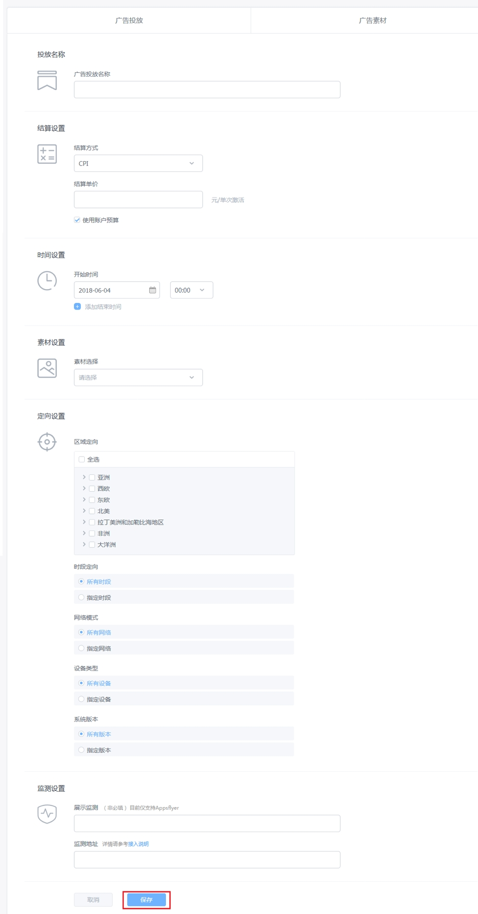
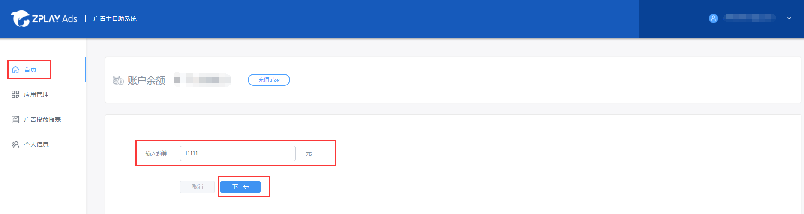

### Index

1. Introduction

2. Add Apps and Creat Campaigns

3. Recharge Your Account

4. Report

5. Financial Management

### 1 Introduction

To promote your game, we suggest you start with the following steps:

Step 1: Add apps (details in 2.1 and 2.5)

Step 2: Creat campaigns (details in 2.6 and 2.7)

Step 3: Recharge your account (details in 3)

Notes: The first two steps should be completed in a sequence. You need add an app first, and then creat a campaign. You can recharge your account at anytime.

### 2 Add Apps and Creat Campaigns

##### 2.1 Select “Application Management” on the left-hand side of the dashboard, and then click the "ADD NEW APP" button.

##### 2.2 There are two parts in this page. The first part is Application Information. The second part is Elements for Making Playable Material.

- Category: Please fill in the application categories accurately, so that we can optimize the advertising effect.
- APP Name: Please fill in the real application name.
- Package Name: Please fill in correct bundle ID, such as "com.zplay.popstar".
- Download URL:Please fill in correct download URL, such as https://itunes.apple.com/cn/app/id834878585, so that we can parse the correct download page.

##### 2.3 Find the app you just added and click the name.

##### 2.4 Click the "AD MATERIAL" tab, and then select the "ADD MATERIAL" button to add playable material for your app.

##### 2.5 上传相关素材，上传完成后，点击“仅添加”，跳转至广告素材列表页；点击“添加素材并创建广告”，进入创建广告投放页面（创建广告投放详见步骤2.6）。此时素材已经处于制作中状态，制作完成后可以在广告投放列表中预览（详见步骤1.8-1.9）

- 素材名称：请填写素材名称，便于分辨不同素材
- 落地页：可玩广告展示完成后展示的图片，图片支持PNG、JPG，720*800/800*720，大小不得超过300K。
- 音频文件：可玩广告展示过程中背景音乐。音频文件仅支持MP3格式，大小不得超过1M，音频文件最短30s。

##### 2.6 点击左侧“广告投放”标签进入广告投放管理页面，点击“添加广告”为您的应用添加广告投放

##### 2.7 填写相关信息后点击“保存”按钮，跳转至广告投放列表页

- 结算设置：目前我们只支持CPI的结算方式。使用账户预算时，我们会将您现在的账户余额作为您一天的投放预算。如果不使用账户预算，您也可以自行设置投放预算，投放预算以天为单位。
- 时间设置：投放结束时间视您需要选择添加。若没有添加结束时间，广告投放在投放预算或账户余额消耗完时停止。
- 素材设置：选择您已创建的素材。若还未创建素材，您需先创建素材。
- 定向设置：您可以根据自己的投放需求设置投放定向。
- 展示监测：展示监测目前仅支持Appsflyer展示监测，展示监测数据您可以在Appaflyer查看。
- 监测地址：填入点击监测地址，若您已经对接 AdMaster、Talking Data、AppsFlyer、Adjust、热云等三方监测平台，填写在对方平台生成的监测地址，若您未接入以上五家监测平台，您可以通过我们提供的激活回传接口，点击“接入说明”查看接口文档。

##### 2.8 广告投放列表中“广告预览”按钮高亮表示素材制作完毕

##### 2.9 点击“广告预览”按钮，扫描二维码预览广告
- 若您的手机中已经安装ZPLAY Ads预览工具，可点击“广告预览”，扫描上方二维码预览广告。
- 若您手机中未安装ZPLAY Ads预览工具，则可扫描下方二维码下载ZPLAY Ads预览工具，然后扫描上方二维码进行预览。

### 3 账户充值

##### 3.1 点击首页“充值”按钮开始充值

##### 3.2 输入充值金额，点击下一步

##### 3.3 在线充值目前仅支持微信与支付宝两种，点击保存后扫描二维码支付即可

注：账户余额不为0时，广告投放才可生效

### 4 数据查询

进入广告投放报表页查询分应用和分广告投放数据

### 5 财务管理

进入财务管理页面查看账户消费信息

