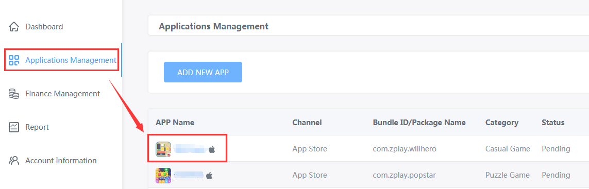

## Index

1. [Introduction](#1-introduction)

2. [Add Apps and Creat Campaigns](#2-add-apps-and-creat-campaigns)

3. [Recharge Your Account](#3-recharge-your-account)

4. [Report](#4-report)

5. [Financial Management](#5-financial-management)

## 1 Introduction

To promote your game, we suggest you start with the following steps:

Step 1: Add Apps (Details in [2.1](#21-application-management))

Step 2: Creat Campaigns (Details in [2.2](#22-ad-campaign))

Step 3: Recharge Your Account (Details in [3](#3-recharge-your-account))

Notes: The first two steps should be completed in a sequence. You need add an app first, and then creat a campaign. While You can recharge your account at anytime.

## 2 Add Apps and Creat Campaigns

### 2.1 Application Management

#### 2.1.1 Application List

Select “Application Management” on the left-hand side of the dashboard to see the Application List.

The list presents some basic information and operations of your apps. 

- Click "Edit" button to edit basic information of your app. If your app has been verified，after modification, your app will be in Pending status. Ads of your app would not run if your app has not been verified.
- Click "Show Campaigns" button to see campaign list of an app. (About Ad Campaign, see in [2.2](#22-ad-campaign))
- Click "Material Library" button to enter Material Library of an app. You can upload promoting elements of your app so that we can creat playable materials for you. (About Material library, see in [2.3](#23-material-library))

#### 2.1.2 Add Apps

Click "ADD NEW APP" button in Application Management page.

There are two parts in this page. The first part is "Application Information", which is required. And the second part is "Elements for Making Playable Material", which is selected.

(1) Application Information (required):

If your app has been launched in App Store or Google Play, click the "Please click here to update the APP information if the APP is online". Fill in the download URL or package name and click "SEARCH", and your app's information will be filled automatically.

If your app has not been launched in the two stores above, click "If the APP is not online, click here to fill in the APP information." to fill in app information.

- Category: Please fill in the application categories accurately, so that we can optimize the advertising effect.
- APP Name: Please fill in the real application name.
- Package Name: Please fill in correct bundle ID, such as "com.zplay.popstar".
- Download URL:Please fill in correct download URL, such as https://itunes.apple.com/cn/app/id834878585, so that we can parse the correct download page.

(2) Elements for Making Playable Material (selected):

Upload pictures, audios, videos, or other elements of your app as much as you can, so that we can create the best playable materials for you. In two ways you can upload your elements. The first way is selecting files directly, which suits for files of small size (no bigger than 20M). The second way is adding online links, such as Drop Box, Google Drive, Sky Drive, Baidu Cloud Drive etc. When you have files of large amount and big size, this way would suits you well. The elements you uploaded will be stored in Material Library. (About Material Library, see in [2.3](#23-material-library))

After filling in the two parts above, select "Add Only", then your files will be uploaded and your app information will be saved; if you select "Add and Creat Campaign", your files will be uploaded and you will jump to the "AD CAMPAIGN" page to creat campaign.

### 2.2 Ad Campaign

#### 2.2.1 Ad Campaign List

In Application Management page, click app name in the list or click "Show Campaigns" button on the right side of the list to enter ad campaign list.

In Ad Campaign List, you can see status, start/end time, budget and CPI of your campaign. You can change campaign settings and status through the operation bar on the right side of the list.

- Start/Pause: Click to control campaign's status. If the campaign is running, click "Pause" to pause this campaign. If the campaign has been paused, click "Start" to start this campaign.
- Edit: Click to update settings of your campaign.
- Copy: Click to copy a campaign you have created, and the new campaign have the same settings of the old one.

#### 2.2.2 Add Campaign

You can reach Add Campaign page in two ways. Way one: click app name on Application List, and then click "ADD CAMPAIGN" button. Way two: click "Add Campaign" button on the right side of Application Management page. 

- Budget Setting: CPI is the only cost type we support now. When using account budget, we will regard your account balance as your budget of a day. If you do not use account budget, you can set budget alternately.
- Time Setting: Add end time according to your demands. If you haven't added end time, the campaign will end after your account balance or budget consumed up. 
- Targeting Settings: You can set your target according to your demands.
- Tracking URL: Fill up the tracking URL in the blanks. If you have intergrated in other tracking platforms such as Appsflyer, adjust, AdMaster, TaklingData, 热云, singular and TUNE, fill in the URLs in these sites. If you haven't intergrated in these platforms, you can set your tracking URL by using "Self Tracking". Click "Introduction" to check how to get tracking URL.

After filling in the information, click "Save" button to creat campain. If you click "Save and Add New Campaign", the campaign you have just created will be saved, and a new campaign--which settings are the same as the old one--will be shown, and you can modify the settings of new campaign.

### 2.3 Material Library

There are two methods to reach Material Library. 

The first method is entering Application Management page, then click "Material Library" button on the right side of the list.

The second method is entering Application Management page, then click app name, and click "Material Library" on the upper-right corner of the page.

In Material Library, you will see files and links that had been uploaded. Click "DELETE", then you can delete these files and links. Click "Add Online Links" or "Select files", then you can add elements of your apps. (The steps are the same as [2.1.2](#-212-add-apps)). After adding/deleting your files, click "Save" to save changes.

### 2.4 Playable Material List

We will make playable materials by using elements you upload. You can preview these materials in "PLAYABLE MATERIAL". Click "Application Management"-name of your app-"PLAYABLE MATERIAL", and you will see the list of materials.

Hover over the preview button, and you will see the QR code.
- If you have ZPLAY Ads tool in your phone, use ZPLAY Ads tool to scan this QR code.
- If you haven't installed ZPLAY Ads tool, scan the smaller QR code on the left side to download ZPLAY Ads tool, and use the tool to scan the bigger QR code.

## 3 Recharge Your Account

### 3.1 Click "Recharge" button on the dashboard.

### 3.2 Enter your budget and click "Next".

### 3.3 We only support Paypal. Click "Save" and scan the QR code to pay. 

Notes: Your ad campaign will be vaild only when the account balance is over 0.

## 4 Report

Click "Report" button on the left side of the page.

- You can see datas of each app/campaign through the filter criteria on the upper area of the page. 

- You can see your report in four dimensions on the bottom of this page. Click blue field on the left side, and you can see the campaign data of date/app/campaign/country. At the same time, the filter criteria you have selected will be shown on the upper area of the page. P.S. Click "20170801" on the bottom, and the date on the upper area of the page will be changed to "20170801"

## 5 Financial Management

Enter Financial Management page to check your financial information.

- You can see your consume before current month in Monthly Consume table. In this table, Cost is your consume we recorded, while Amount is money you need to pay after examination. 

- You can see your recharge record in Recharge Record table. 

