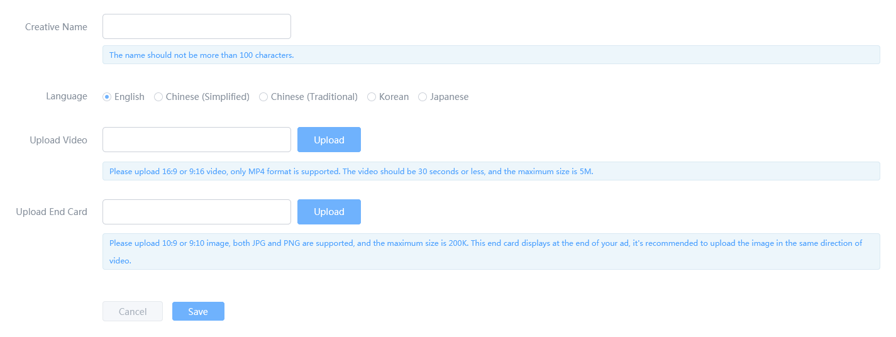

## Index
- [1 Introduction](#1-introduction)
- [2 Application Management](#2-application-management)
  - [2.1 Add Apps](#21-add-apps)
  - [2.2 Application List](#22-application-list)
  - [2.3 Material Library](#23-material-library)
- [3 Campaign Management](#3-campaign-management)
  - [3.1 Add Campaign](#31-add-campaign)
  - [3.2 Campaign List](#32-campaign-list)
- [4 Creative Management](#4-creative-management)
  - [4.1 Add Creative](#41-add-creative)
    - [4.1.1 Add H5 Creative](#411-add-h5-creative)
    - [4.1.2 Add Video Creative](#412-add-video-creative)
  - [4.2 Creative List](#42-creative-list)
- [5 Recharge Your Account](#5-recharge-your-account)
- [6 Report](#6-report)
  - [6.1 Filter](#61-filter)
  - [6.2 View Report in Dimensions](#62-view-report-in-dimensions)
- [7 Finance Management](#7-finance-management)

## 1 Introduction

To promote your game, we suggest you start with the following steps:

Step 1: Add Apps (Details in [2 Application Management](#2-application-management))

Step 2: Add Campaigns (Details in [3 Campaign Management](#3-campaign-management))

Step 3: Add Creatives (Details in [4 Creative Management](#4-creative-management))

Step 4: Recharge Your Account (Details in [5 Recharge Your Account](#5-recharge-your-account))

Notes: You can add campaigns or creatives only after adding apps. While You can recharge your account at any time.

## 2 Application Management

### 2.1 Add Apps

Click the "ADD NEW APP" button in Application Management page.

There are two parts on this page. The first part is "Application Information", which is required. And the second part is "Elements for Making Playable Material", which is selected.

(1) Application Information (required):

If your app has been launched in App Store or Google Play, fill in the download URL or package name and click "SEARCH", and your app's information will be filled automatically.

If your app has not been launched in the two stores above, click "If the APP is not online, click here to fill in the APP information." to fill in app information.

- Category: Please fill in the application category accurately, so that we can optimize the advertising effect;
- APP Name: Please fill in the real application name;
- Bundle ID/Package Name: Please fill in correct bundle ID or package name, such as "com.zplay.popstar";
- Download URL: Please fill in correct download URL, so that we can parse the correct download page;

(2) Elements for Making Playable Creative (selected):

Upload pictures, audios, videos, or other elements of your app as much as you can, so that we can create the best playable materials for you. In two ways you can upload your elements. The first way is selecting files directly, which suits for files of small size (no bigger than 20M). The second way is adding online links, such as DropBox, Google Drive, Sky Drive, Baidu Cloud Drive, etc. When you have files of a large amount and big size, this way would suits you well. The elements you uploaded will be stored in Material Library. (About Material Library, see in [2.3 Material Library](#23-material-library))

After filling in the two parts above, select "Add Only", then your files will be uploaded and your app information will be saved; if you select "Add and Create Campaign", your files will be uploaded and you will jump to the "AD CAMPAIGN" page to create a campaign. (About creating campaign, see in [3.1 Add Campaign](#31-add-campaign)) 

### 2.2 Application List

Select “Application Management” on the left-hand side of the dashboard to see the Application List. In the Application List, you can see APP name, channel, bundle ID/package name, category, status and operations of your apps.

- Click the "Edit" button to edit basic information of your app. If your app has not been launched in App Store or Google Play, your app will be in Pending status after modification. Ads of your app would not run if your app has not been verified;
- Click "Show Campaigns" button to see campaign list of your app; (About campaign, see in [3 Campaign Management](#3-campaign-management))
- Click "Add Campaign" to create a campaign for your app; (About creating campaign, see in [3.1 Add Campaign](#31-add-campaign)) 
- Click "Material Library" button to enter Material Library of your app. You can upload promoting elements of your app so that we can create playable creative for you. (About Material library, see in [2.3 Material Library](#23-material-library))

### 2.3 Material Library

There are two methods to reach Material Library:  

(1) The first method is entering the "Application Management" page, then click "Material Library" button on the right side of the list;

(2) The second method is entering "Application Management" page, then click the app name, and click "Material Library" on the upper-right corner of the page;

In Material Library, you will see files and links that had been uploaded. Click "Delete", then you can delete these files and links. Click "Add Online Links" or "Select files", then you can add elements of your apps. (The steps are the same as [2.1 Add Apps](#21-add-apps)). After adding/deleting your files, click "Save" to save changes.

## 3 Campaign Management

### 3.1 Add Campaign

You can reach the Add Campaign page in two ways:

(1) Click "Add Campaign" button on the right side of the Application Management page. 

(2) Click app name on Application List, and then click the "ADD CAMPAIGN" button; 

You should do as following when adding campaign:

(1) Basic Information

- Campaign Name: Please fill in your campaign name;
- Budget Setting: CPI is the only cost type we support now. When using the account budget, we will regard your account balance as your budget of a day. If you do not use the account budget, you can set budget alternately;
- Time Setting: Add end time according to your demands. If you haven't added end time, the campaign will end after your account balance or budget consumed up;

(2) Target Settings

Targeting Settings: You can set your target according to your demands.

(3) Tracking Setting

- If you have integrated with other tracking platforms such as Appsflyer, Adjust, AdMaster, TaklingData, 热云, Singular, TUNE and Umeng, fill in the View-Through Tracking URL and Tracking URL acquired in these sites;
- If you haven't integrated with the above platforms, you can set your tracking URL by using "Self Tracking". Click "[Introduction](https://github.com/zplayads/Help-Center-for-Promotion/blob/master/Tracking/ZPLAY%20Ads%20Advertiser%20Server%20to%20Server%20Install%20Tracking.md)" to check how to get tracking URL;

(4) Creatives

Choose creatives that related to your campaign. You can choose whether all creatives or specific creative(s). When there is no creative created under your app, you can only select "All".

(5) Save and Add New Campaign

After filling in the information, click "Save" button to create a campaign. If you click "Save and Add New Campaign", the campaign you have just created will be saved, and a new campaign--which settings are the same as the old one--will be shown, and you can modify the settings of a new campaign.

### 3.2 Campaign List
In the Application Management page, click app name in the list or click "Show Campaigns" button on the right side of the list to enter ad campaign list.

In Ad Campaign List, you can see the status, start/end time, budget and CPI of your campaign. You can change campaign settings and status through the operation bar on the right side of the list.

- Start/Pause: Click to control the campaign's status. If the campaign is running, click "Pause" to pause this campaign. If the campaign has been paused, click "Start" to start this campaign;
- Edit: Click to update settings of your campaign;
- Copy: Click to copy a campaign you have created, and the new campaign has the same settings as the old one;

## 4 Creative Management
### 4.1 Add Creative

Click app name on Application List, and then click "PLAYABLE CREATIVE" on the right side of the page to reach the creative list page; 

#### 4.1.1 Add H5 Creative

Click "ADD H5 CREATIVE" button in campaign list page to add H5 creative.

- Creative Name: Name of your H5 creative. The name should not be more than 100 characters;
- Language: Language of your H5 creative. We support English, Chinese (Simplified), Chinese (Traditional), Korean and Japanese now; 
- Upload Creative: Please upload H5 creative. The HTML File uploaded will be checked automatically. You can save your H5 creative only with the check passed. When your HTML did not pass the check, please check your HTML file according to the [Specification for H5 Playable Creative](https://github.com/zplayads/specification-for-H5-playable-creative);

After filling in the blanks, click "SAVE" to save the H5 creative.

#### 4.1.2 Add Video Creative

Click "ADD VIDEO CREATIVE" button in campaign list page to add video creative.

- Creative Name: Name of your video creative. The name should not be more than 100 characters;
- Language: Language of your H5 creative. We support English, Chinese (Simplified), Chinese (Traditional), Korean and Japanese now; 
- Upload Video: Please upload 16:9 or 9:16 video, only MP4 format is supported. The video should be 30 seconds or less, and the maximum size is 5M;
- Upload End Card: Please upload 10:9 or 9:10 image, both JPG, and PNG are supported, and the maximum size is 200K. This end card displays at the end of your ad, it's recommended to upload the image in the same direction of video;

After filling in the blanks, click "SAVE" to save the video creative.

### 4.2 Creative List

Click app name on Application List, and then click "PLAYABLE CREATIVE" on the right side of the page to reach the creative list page. In Creative List, you can see creative name, language, creative type, creative source, status and update time of your creative. You can preview your creative, change creative settings and status through the operation bar on the right side of the list.

- Start/Pause: Click to change the status of the creative;
- Preview Native: Hover over the "Preview Native" button to preview the creative's display on native traffic. A creative without complete native information could not be previewed the native part;
- Edit Native: Click to edit the native part of the creative. We will deliver creatives with a native part to native traffic.
- Preview Playable/Video: You can preview the playable or video creative through this button. Hover over the button and you will see the QR code:
  - If you have ZPLAY Ads tool in your phone, use ZPLAY Ads tool to scan this QR code;
  - If you haven't installed ZPLAY Ads tool, scan the smaller QR code on the left side to download ZPLAY Ads tool, and use the tool to scan the bigger QR code;
- Edit Playable/Video: Click to edit your playable creative or h5 creative;

## 5 Recharge Your Account

(1) Click the "Recharge" button on the dashboard;

(2) Enter your budget and click "Next";

(3) If your settlement currency is RMB, you can use WeChat to recharge your account. If your settlement currency is USD, you can use Stripe to recharge your account. Click "Save" and pay;

Notes: Your campaign will be valid only when the account balance is over 0.

## 6 Report

Click the "Report" button on the left side of the page.

### 6.1 Filter

You can see your data of each app/campaign/country/date through the filter criteria on the upper area of the page. After adding specific filter criteria, the line chart on the middle of the page and the table on the bottom will both show the filtered data. For example: if you select 2018/09/01 on the upper filter, then all the data on this page displayed is based on the date you selected. 

### 6.2 View Report in Dimensions

You can see your report in date dimension, app dimension, campaign&creative dimension and country dimension on the bottom of this page. In campaign&creative dimension, you can view your report in campaign dimension, creative dimension, and campaign-creative related dimension;

## 7 Finance Management

Enter the "Finance Management" page to check your financial information.

- You can see your consumption before the current month in "Monthly Consume" table. In this table, Cost is your consume we recorded, while Amount is money you need to pay after examination; 

- You can see your recharge record in "Recharge Record" table; 

