### 目录
1. 说明[#1_说明]

2. 添加应用及广告投放[#2-添加应用及广告投放]

3. 账户充值[#3-账户充值]

4. 数据查询[#4-数据查询]

5. 财务管理[#5-财务管理]

### 1 说明

广告主进入系统后，建议的操作路径为：

第1步: 添加应用与素材（请参考2.1至2.5的介绍）

第2步: 添加广告（请参考2.6至2.8的介绍）

第3步: 充值（请参考3的介绍）

提醒：第1步到第2步是有前后顺序的，必须先添加应用与素材，再添加广告。充值可以在此之前或者之后完成。

### 2 添加应用及广告投放

##### 2.1 进入“应用管理”页面，点击“添加应用”

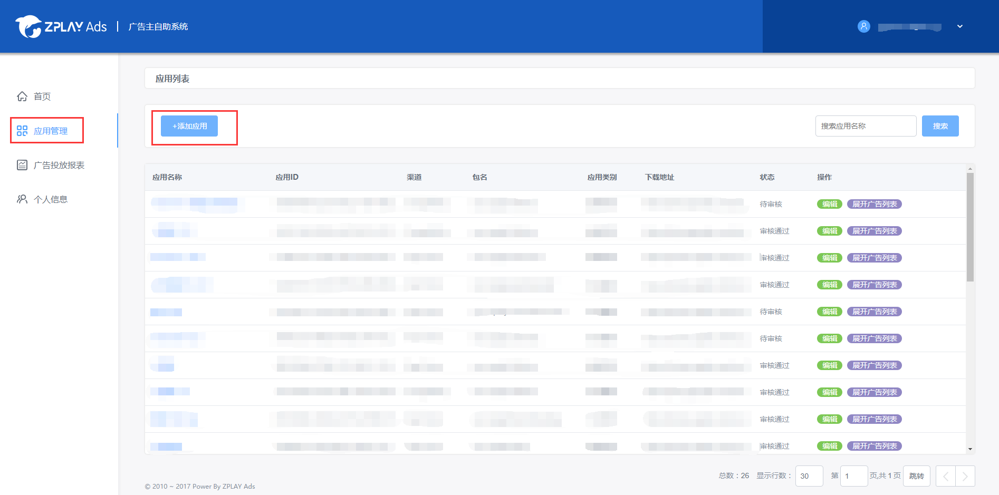

##### 2.2 进入添加应用页面，该页面有两部分，第一部分是应用信息，第二部分是应用元素及推广素材。

应用信息部分均为必填项。

- 应用分类：请准确填写应用所属类别，便于我们对广告投放效果进行优化
- 应用名称：请填写真实的应用名称，如“消灭星星-Popstar官方正版”
- 应用icon：请上传应用真实icon，icon会用于物料制作
- 应用包名：请输入应用主包名，该包名是应用的唯一识别。如“com.zplay.popstar”
- 下载地址：对于iOS应用请填写规范的iTunes地址，便于可以正常解析出应用下载页面

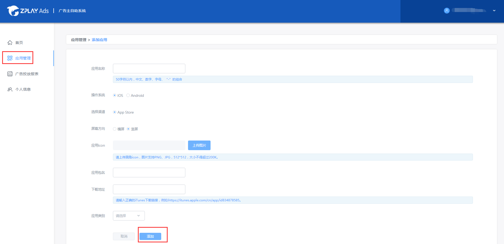

应用元素及推广素材为选填。您可以上传和自己游戏相关的素材，以便我们更好地为您制作可玩的广告创意。上传素材有两种途径，第一，直接上传，适用于较小的文件。第二，填写网盘地址，适用于文件数量较多，大小较大的情况。您的素材将被上传到应用素材库。（关于素材库，详见步骤2.4）

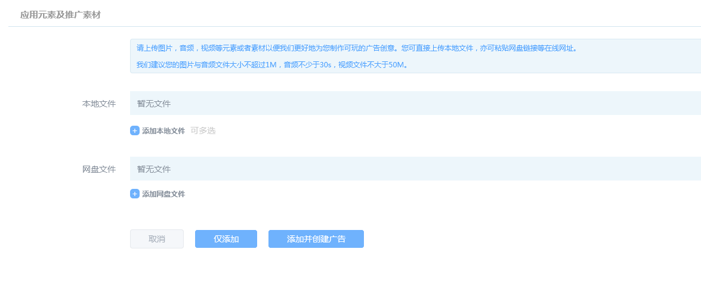

两部分信息填写完成后，选择仅添加，即可上传文件并保存您填写的应用信息。选择添加并创建广告，即可上传文件，保存您填写的应用信息，并进入到创建广告投放页面（创建广告投放详见步骤2.6）。

##### 2.3 您有两个途径可以进入应用的素材库。

第一，进入“应用管理”页面，在应用列表右侧找到“素材库”按钮，进入该应用下的素材库。

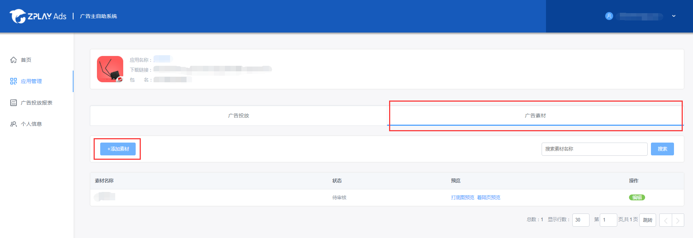

第二，进入“应用管理”页面，点击应用名称，进入应用的广告投放页面，点击右上方的“素材库”，进入该应用下的素材库。

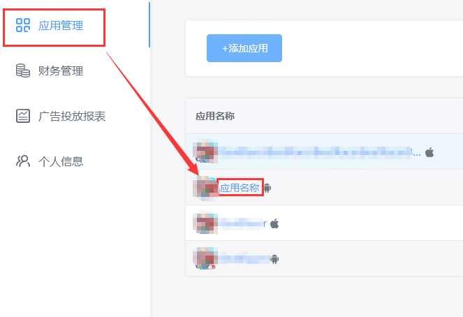

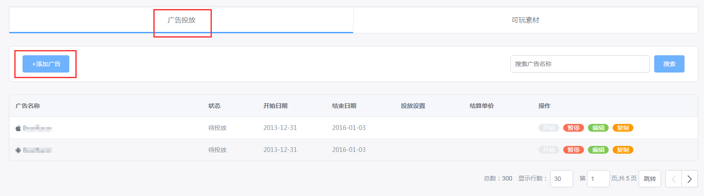

##### 2.4 素材库页面。

在素材库里，你可以看到已经上传的文件与链接。点击“删除”，可删除这些文件与链接，点击“添加网盘/本地文件”，可添加文件，添加方法同2.2。对文件进行更改后，点击“保存”，保存更改。

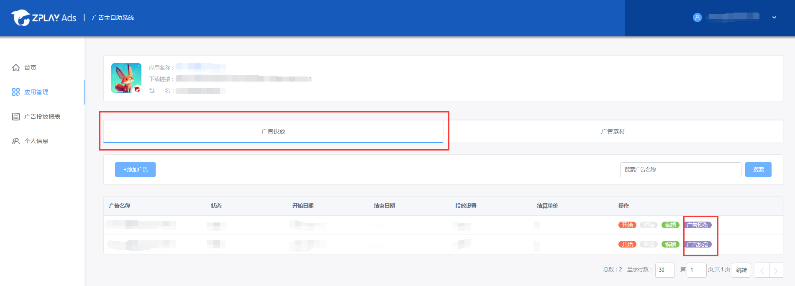

##### 2.5 上传应用元素及推广素材后，我们会将这些元素制作成可玩素材。您可以在可玩素材列表页预览这些素材。点击应用管理-应用名称-可玩素材，即可进入可玩素材列表页

在可玩素材列表页，鼠标悬浮到预览按钮上方，出现二维码。
- 若您的手机中已经安装ZPLAY Ads预览工具，可扫描右方二维码预览广告。
- 若您手机中未安装ZPLAY Ads预览工具，则可扫描左方较小的二维码下载ZPLAY Ads预览工具，然后打开该工具，扫描右方的二维码进行预览。

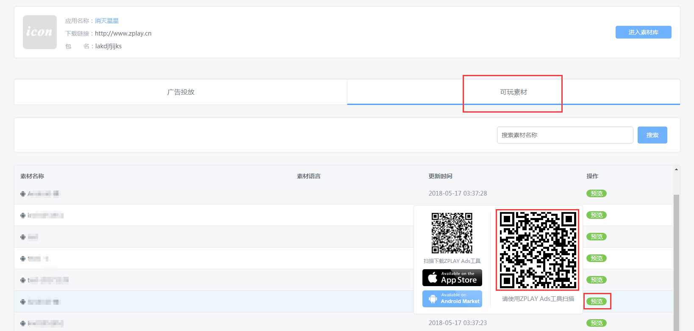

##### 2.6 点击左侧“广告投放”标签进入广告投放管理页面，点击“添加广告”为您的应用添加广告投放

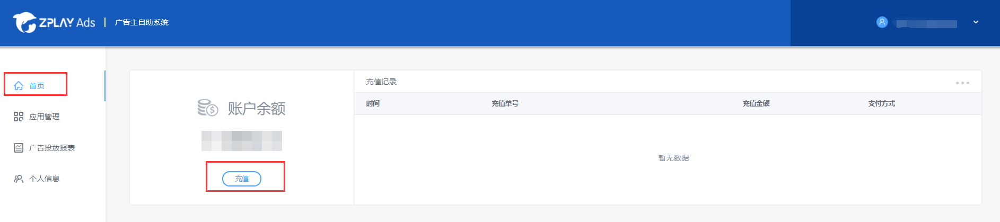

##### 2.7 填写相关信息后点击“保存”按钮，跳转至广告投放列表页

- 结算设置：目前我们只支持CPI的结算方式。使用账户预算时，我们会将您现在的账户余额作为您一天的投放预算。如果不使用账户预算，您也可以自行设置投放预算，投放预算以天为单位。
- 时间设置：投放结束时间视您需要选择添加。若没有添加结束时间，广告投放在投放预算或账户余额消耗完时停止。
- 定向设置：您可以根据自己的投放需求设置投放定向。
- 展示监测/监测地址：填入监测地址，若您已经对接Appsflyer、adjust、AdMaster、TaklingData、热云、singular、TUNE等三方监测平台，填写在对方平台生成的监测地址，若您未接入以上八家监测平台，您可以通过我们提供的激活回传接口，点击“接入说明”查看如何获取监测地址。

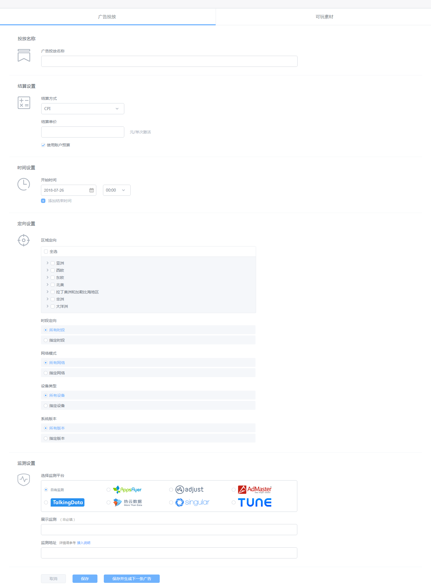

##### 2.8 广告创建完成，在广告投放页查看广告的状态。

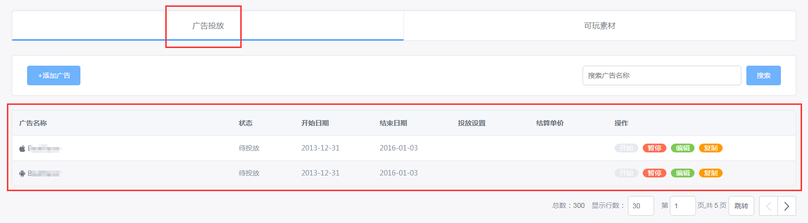

### 3 账户充值

##### 3.1 点击首页“充值”按钮开始充值

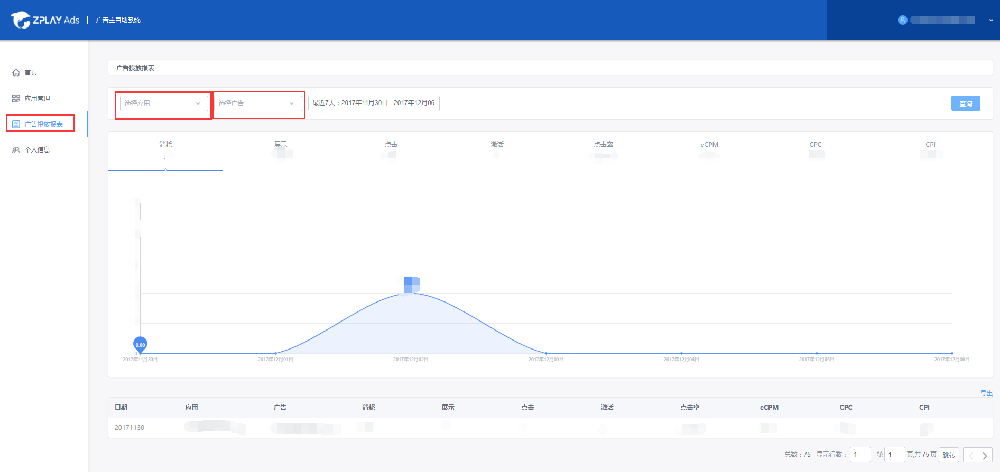

##### 3.2 输入充值金额，点击下一步

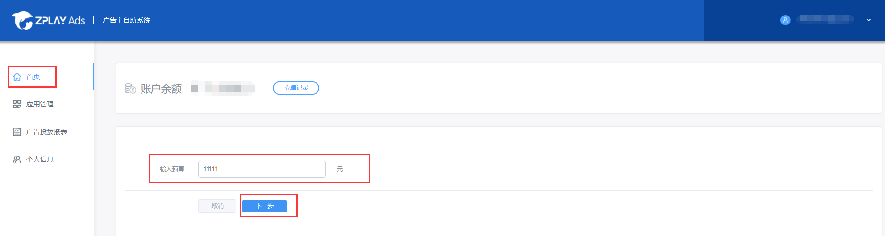

##### 3.3 在线充值目前仅支持微信与支付宝两种，点击保存后扫描二维码支付即可

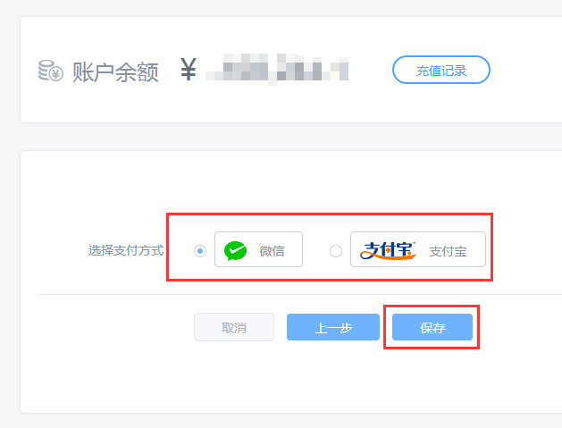

注：账户余额不为0时，广告投放才可生效

### 4 数据查询

进入广告投放报表页查询分应用和分广告投放数据

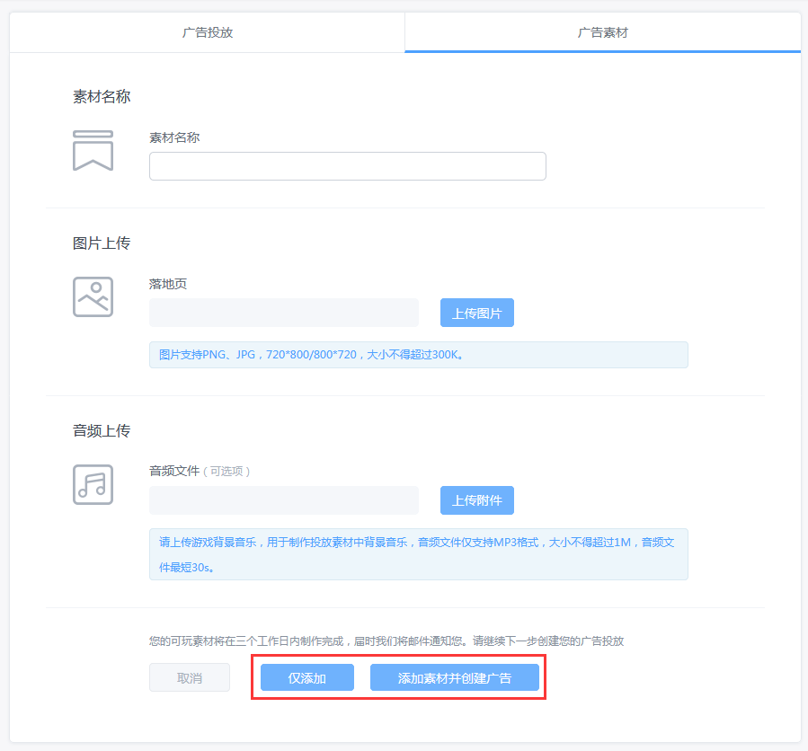

### 5 财务管理

进入财务管理页面查看账户消费信息

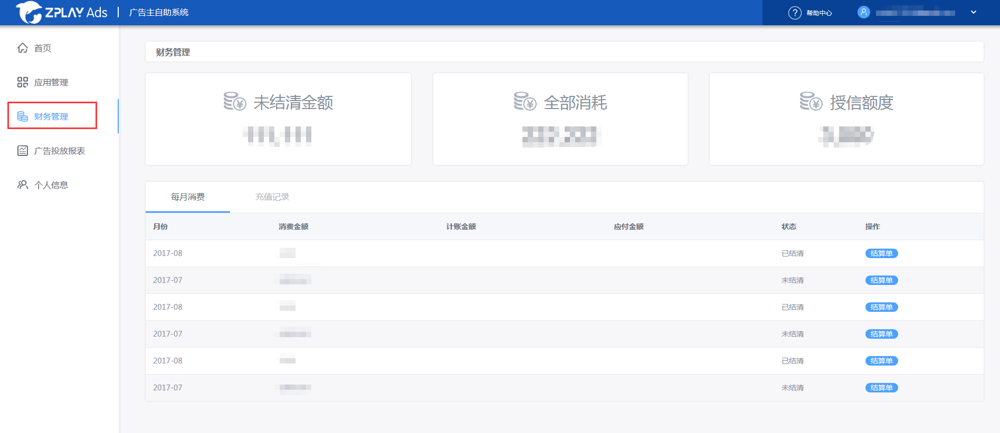