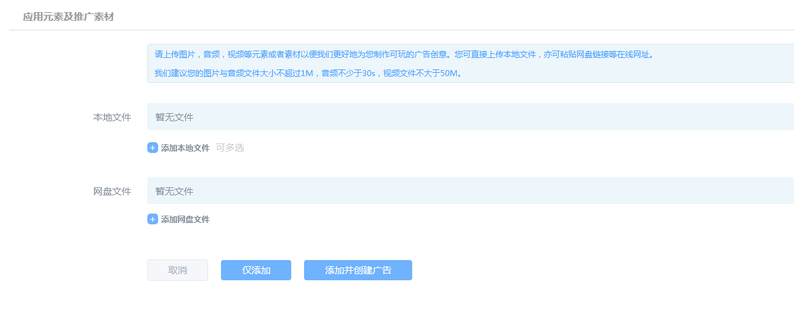
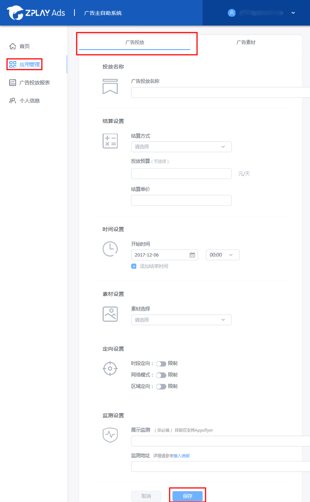

### 目录
1. 说明

2. 添加应用及广告投放

3. 账户充值

4. 数据查询

### 1 说明
广告主进入系统后，建议的操作路径为：

第1步: 添加应用（请参考2.1及2.2的介绍）

第2步: 上传素材（请参考2.4及2.5的介绍）

第3步: 添加广告（请参考2.6及2.7的介绍）

第4步: 充值（请参考3的介绍）

提醒：第1步到第3步是有前后顺序的，必须先添加应用，再上传素材，然后添加广告。充值可以在此之前或者之后完成。

### 2 添加应用及广告投放

##### 2.1 进入“应用管理”页面，点击“添加应用”

##### 2.2 填写相关信息后，点击“保存”，回到应用管理页面

- 应用名称：请填写真实的应用名称，如“消灭星星-Popstar官方正版”
- 屏幕方向：请选择与应用被使用时一致的屏幕方向
- 应用icon：请上传应用真实icon，icon会用于物料制作
- 应用下载地址：对于iOS应用请填写规范的iTunes地址，便于可以正常解析出应用下载页面
- 应用类别：请准确填写应用所属类别，便于我们对广告投放效果进行优化

##### 2.3 找到创建的应用，点击应用名称，进入应用广告投放及广告素材管理页面

##### 2.4 页面中选择右侧“广告素材”进入素材管理页面。点击“添加素材”为您的应用添加可玩素材

##### 2.5 上传相关素材，点击“保存”，跳转至广告素材列表页。此时素材已经处于制作中状态，制作完成后可以在广告投放列表中预览（详见步骤1.8-1.9）

- 播放完成着陆页图片：可玩广告展示完成后展示的图片，需上传与1.2步骤中应用屏幕方向一致的图片
- 音频文件：可玩广告展示过程中背景音乐

##### 2.6 点击左侧“广告投放”标签进入广告投放管理页面，点击“添加广告”为您的应用添加广告投放

##### 2.7 填写相关信息后点击“保存”按钮，跳转至广告投放列表页

- 时间设置：投放结束时间视您需要选择添加。若没有添加结束时间，广告投放在投放预算或账户余额消耗完时停止
- 素材设置：选择您已创建的素材。若还未创建素材，您需先创建素材
- 展示监测：展示监测目前仅支持Appsflyer展示监测，展示监测数据您可以在Appaflyer查看
- 监测地址：填入点击监测地址，若您已经对接 AdMaster、Talking Data、AppsFlyer、Adjust、热云等三方监测平台，填写在对方平台生成的监测地址，若您未接入以上五家监测平台，您可以通过我们提供的激活回传接口，点击“接入说明”查看接口文档

##### 2.8 广告投放列表中“广告预览”按钮高亮表示素材制作完毕

##### 2.9 点击“广告预览”按钮，扫描二维码预览广告
- 若您的手机中已经安装ZPLAY Ads预览工具，可点击“广告预览”，扫描上方二维码预览广告。
- 若您手机中未安装ZPLAY Ads预览工具，则可扫描下方二维码下载ZPLAY Ads预览工具，然后扫描上方二维码进行预览。

### 3 账户充值

##### 3.1 点击首页“充值”按钮开始充值

##### 3.2 输入充值金额，点击下一步

##### 3.3 在线充值目前仅支持微信与支付宝两种，点击保存后扫描二维码支付即可

注：账户余额不为0时，广告投放才可生效

### 4 数据查询

进入广告投放报表页查询分应用和分广告投放数据

