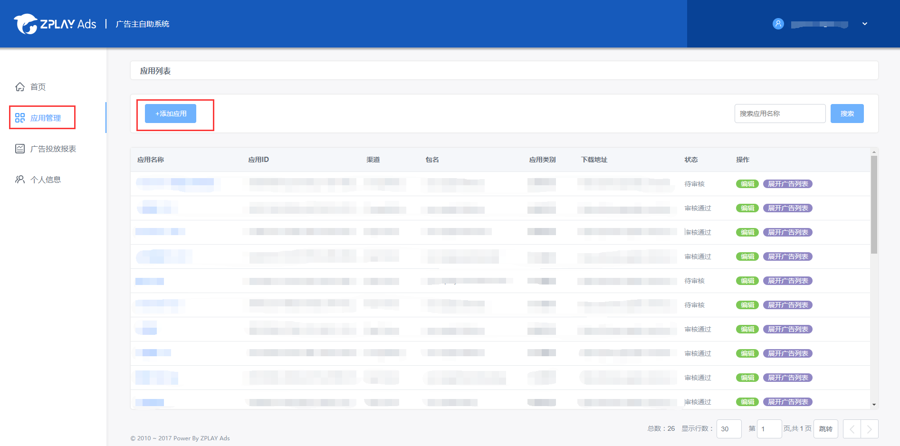
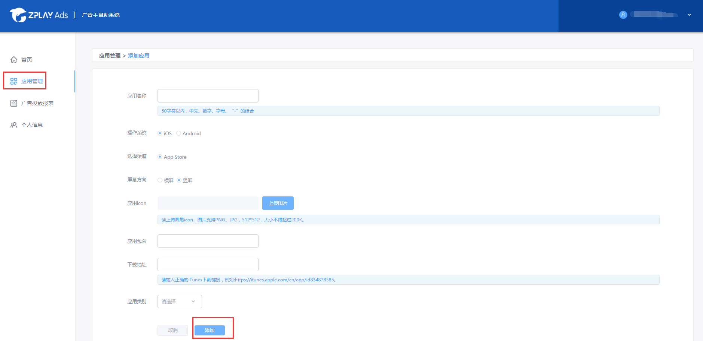
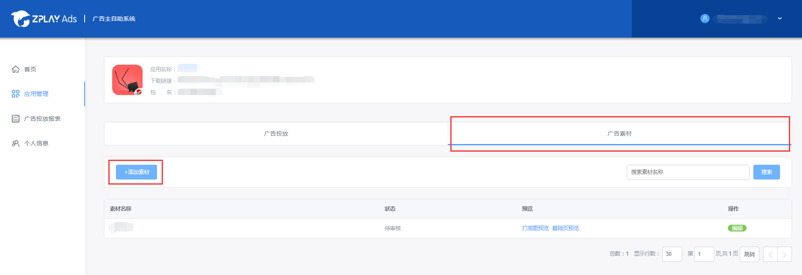
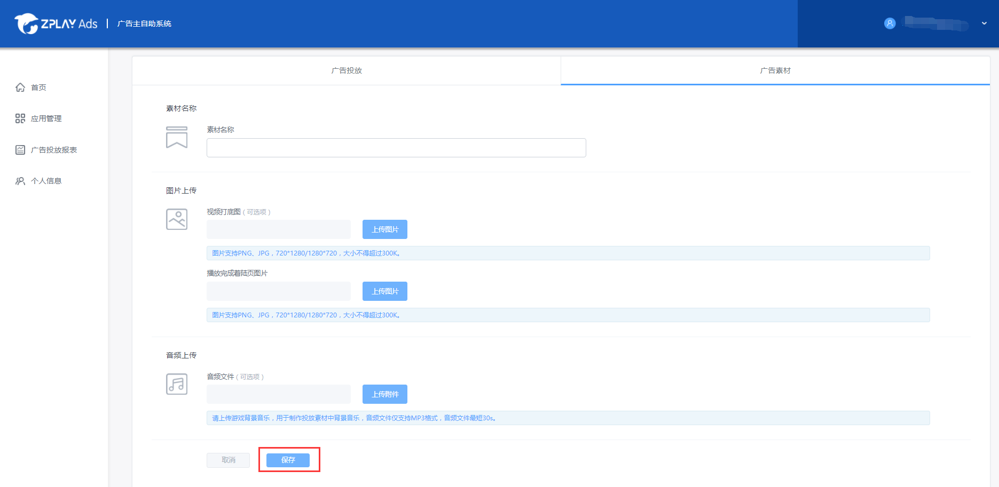
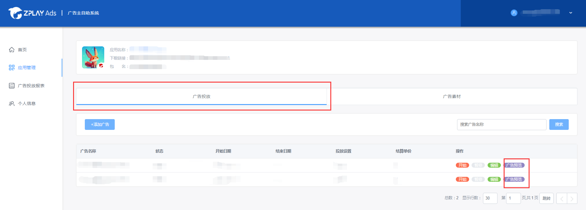
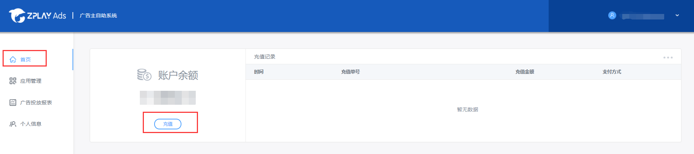
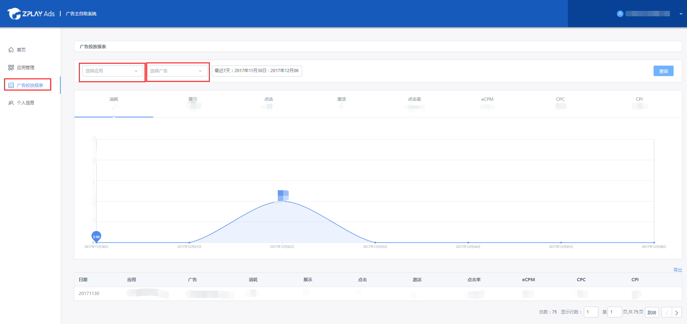
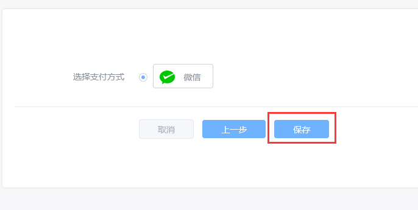

## 目录
- [1 说明](#1-说明)
- [2 应用管理](#2-应用管理)
    - [2.1 添加应用](#21-添加应用)
    - [2.2 应用列表](#22-应用列表)
    - [2.3 应用素材库](#23-应用素材库)
- [3 投放管理](#3-投放管理)
    - [3.1 添加广告](#31-添加广告)
    - [3.2 广告投放列表](#32-广告投放列表)
- [4 创意管理](#4-创意管理)
    - [4.1 添加创意](#41-添加创意)
        - [4.1.1 添加H5创意](#411-添加h5创意)
        - [4.1.2 添加视频创意](#412-添加视频创意)
    - [4.2 创意列表](#42-创意列表)
- [5 账户充值](#5-账户充值)
- [6 数据查询](#6-数据查询)
    - [6.1 数据筛选](#61-数据筛选)
    - [6.2 分维度数据报表](#62-分维度数据报表)
- [7 财务管理](#7-财务管理)

## 1 说明

广告主进入系统后，建议的操作路径为：

第1步：添加应用（请参考[2 应用管理](#2-应用管理)的介绍）

第2步：添加广告（请参考[3 投放管理](#3-投放管理)的介绍）

第3步：添加创意（请参考[4 创意管理](#4-创意管理)的介绍）

第4步：充值（请参考[5 账户充值](#5-账户充值)的介绍）

提醒：您需要添加应用后，才可以添加广告或者创意；充值则可以在任何时间完成。

## 2 应用管理

### 2.1 添加应用

在应用管理页面，点击“添加应用”，进入添加应用的界面。

该页面有以下两部分，第一部分是应用信息，该部分为必填项。第二部分是应用元素及推广素材，该部分为选填项。

1、应用信息，该部分为必填项；

如果您的应用已经在App Store或Google Play上线，请直接输入苹果商店应用URL或应用包名，并点击“查找”。您的应用信息将被自动补全。

如果您的应用没有在以上两个商店上线，请点击“若应用未上线，请点击此处”，手动填写应用信息。

- 应用分类：请准确填写应用所属类别，便于我们对广告投放效果进行优化；
- 应用名称：请填写真实的应用名称，如“消灭星星-Popstar官方正版”；
- 应用icon：请上传应用真实icon，icon会用于物料制作；
- 应用包名：请输入应用主包名，该包名是应用的唯一识别。如“com.zplay.popstar”；
- 下载地址：请填写规范的下载地址，以便正常解析出应用下载页面；

2、应用元素及推广素材，该部分为选填项

您可以上传图片，音频，视频等元素或者素材以便我们更好地为您制作可玩的广告创意。上传素材有两种途径，第一，直接上传，适用于较小的文件（不大于20M）。第二，填写网盘地址，适用于文件数量较多，文件大小较大的情况。您的素材将被上传到应用素材库。（关于素材库，详见[2.3 应用素材库](#23-应用素材库)）

两部分信息填写完成后，选择“仅添加”，即可上传文件并保存您填写的应用信息。选择“添加并创建广告”，即可上传文件，保存您填写的应用信息，并进入到创建广告投放页面。（关于创建广告投放，详见[3 投放管理](#3-投放管理)）

### 2.2 应用列表

进入“应用管理”页面，查看应用列表。在应用列表页，可以看到应用的渠道、包名、应用类别和状态，右侧操作栏可以对应用进行操作。

- 点击“编辑”，可编辑应用的基本信息。若您编辑的应用未在App Store或Google Play上线，则编辑后，应用将为待审核状态。审核通过后，应用下的广告才会投放；
- 点击“展开广告列表”，跳转到该应用下的广告投放页，可以查看该应用的广告投放信息；（关于广告投放，详见[3 投放管理](#3-投放管理)）
- 点击“创建投放”，可为该应用创建广告投放；（关于创建投放，详见[3.1 添加广告](#31-添加广告)）
- 点击“素材库”，可进入该应用的素材库。在素材库里，你可以上传与应用相关的推广元素，以便我们为您制作可玩素材；（关于素材库，详见[2.3 应用素材库](#23-应用素材库)）

### 2.3 应用素材库

您有两个途径可以进入应用的素材库:

1、进入“应用管理”页面，在应用列表右侧找到“素材库”按钮，进入该应用下的素材库；

2、进入“应用管理”页面，点击应用名称，进入应用的广告投放页面，点击右上方的“素材库”，进入该应用下的素材库；

在素材库里，你可以看到已经上传的文件与链接。点击“删除”，可删除这些文件与链接，点击“添加网盘/本地文件”，可添加文件，添加方法同[2.1 添加应用](#21-添加应用)。对文件进行更改后，点击“保存”，保存更改。

## 3 投放管理

### 3.1 添加广告

您有两种途径可以为应用添加广告：

1、点击“应用管理”进入应用列表页，找到您想创建投放的应用，并点击该应用右侧操作栏中的“创建投放”按钮；

2、点击“应用管理”进入应用列表页，找到您想创建投放的应用，并点击该应用的应用名称，在广告投放列表页，点击“添加广告”按钮；

添加广告时，您需要进行以下操作：

1、广告基本信息

- 广告投放名称：请填写该投放的名称；
- 结算设置：目前ZPLAY Ads仅支持CPI的结算方式。若勾选“使用账户预算”，会将您账户余额作为此投放的单日预算。若不勾选“使用账户预算”，您可以自行设置单日投放预算；
- 时间设置：投放结束时间视您需要选择添加。若没有添加结束时间，广告投放在投放预算或账户余额消耗完时停止；

2、定向设置

  您可以根据自己的投放需求设置投放定向；

3、监测设置
- 若您已经对接Appsflyer、Adjust、AdMaster、TaklingData、热云、Singular、TUNE、友盟等三方监测平台，填写“展示监测”与“监测地址”填写在对方平台获取到的ZPLAY Ads的展示监测地址与点击监测地址；
- 若您未接入以上监测平台，您可以通过ZPLAY Ads提供的激活回传接口回传激活数据。选择“自有监测”，点击“[接入说明](https://github.com/zplayads/Help-Center-for-Promotion/blob/master/Tracking/ZPLAYAds%E5%B9%BF%E5%91%8A%E4%B8%BB%E5%BA%94%E7%94%A8%E6%BF%80%E6%B4%BB%E5%9B%9E%E4%BC%A0%E6%8E%A5%E5%8F%A3.md)”查看对接文档;

4、投放创意
选择此广告投放要投放的的创意。您可以选择所有创意，也可以选择指定创意。当您的广告所属的应用下还未添加创意时，只能选择所有创意；

5、保存或创建下一条广告

填写完成后，点击“保存”，保存您当前添加的广告投放。点击“保存并生成下一条广告”，保存您当前添加的广告投放，并打开创建投放页面，页面中数据自动填充当前广告投放数据，您可以对这条投放进行调整，方便您快捷添加广告。

### 3.2 广告投放列表

在应用管理页面，点击应用列表中的应用名称，或点击应用列表右侧的“展开广告列表”，进入广告投放列表页。

在广告投放列表页，可以看到广告的投放状态、起止日期、投放设置和结算单价。右侧操作栏可以对广告进行操作。

- 开始/暂停：点击可控制广告的投放状态。投放中的广告，点击“暂停”，可暂停投放。暂停中的广告，点击“开始”，可开始投放;
- 编辑：点击可更新广告投放的设置;
- 复制：点击可复制该广告，将快速生成一条除名称外与原广告完全一致的广告;

## 4 创意管理

### 4.1 添加创意

点击应用列表里的应用名称，并在广告投放页点击右侧的“可玩创意”，可以进入创意列表页；

#### 4.1.1 添加H5创意

在创意列表页，点击“添加H5创意”，可添加H5创意。

- 创意名称：H5创意的名称，需在100字符以内；
- 创意语言：创意的语言，目前支持简体中文、繁体中文、英文、韩文和日文五种语言；
- 上传创意：请上传您制作的H5创意，上传后的创意将被自动检测，只有检测通过的创意才可以被保存；当您的创意检测未通过时，请根据[H5创意制作规范](https://github.com/zplayads/specification-for-H5-playable-creative)检查您的H5创意；

各项填写完成后，点击“保存”，即可保存H5创意。

#### 4.1.2 添加视频创意

在创意列表页，点击“添加视频创意”，可添加视频创意。

- 创意名称：视频创意的名称，需在100字符以内；
- 创意语言：创意的语言，目前支持简体中文、繁体中文、英文、韩文和日文五种语言；
- 上传视频：请上传16:9或9:16的MP4格式视频，视频长度不超过30秒，大小不超过5M；
- 上传落地页：请上传10:9或9:10的PNG/JPG格式图片，大小不超过200K，此图片会展示在广告的末尾出现，建议上传与视频方向一致的图片；

各项填写完成后，点击保存，即可保存视频创意。

### 4.2 创意列表

点击应用列表里的应用名称，并在广告投放页点击右侧的“可玩创意”，可以进入创意列表页；您可以在创意列表页查看您添加的创意的名称，语言，类型，来源，状态和编辑时间，右侧操作栏可以对创意进行操作。

- 开始/暂停：点击可控制创意的状态；
- 原生预览：鼠标悬浮到原生预览按钮上方，即可预览该创意在原生流量上的展示效果；原生部分没有补全的创意，无法预览；
- 编辑原生：点击即可对创意的原生部分进行编辑，我们将会把有原生部分的创意投放到原生流量中；创意的原生部分不会影响可玩/视频部分的展示；
- 可玩/视频预览：当您的创意类型为可玩或H5时，可以对可玩物料进行预览；当您的创意类型为视频时，可以对视频物料进行预览；鼠标悬浮到该按钮上方，出现二维码：
  - 若您的手机中已经安装ZPLAY Ads预览工具，可扫描右方二维码预览广告；
  - 若您手机中未安装ZPLAY Ads预览工具，则可扫描左方较小的二维码下载ZPLAY Ads预览工具，然后打开该工具，扫描右方的二维码进行预览；
- 编辑可玩/视频：当您的创意类型为H5时，可以点击编辑可玩，对H5创意进行编辑；当您的创意类型为视频时，可以点击编辑视频，对视频创意进行编辑；

## 5 账户充值

1、点击首页“充值”按钮开始充值；

2、输入充值金额，点击下一步；

3、若您使用人民币结算，我们支持使用微信进行在线充值，若您使用美元结算，我们支持使用Stripe进行在线充值；点击“保存”后支付即可；

注：账户余额不为0时，广告投放才可生效。

## 6 数据查询

点击广告投放报表页，查看广告投放数据。

### 6.1 数据筛选

您可以通过上方筛选框查看具体某个应用/广告/创意/国家/日期的数据；筛选后，中间折线图与下方列表也会显示依据该筛选条件的数据。如：上方日期选择了“2018年09月01日”，则下方的所有数据都是2018年09月01日产生的数据；

### 6.2 分维度数据报表

您在下方广告投放报表，点击下方不同维度的按钮，可查看日期维度、应用维度、广告&创意维度、国家维度下的广告投放数据；其中“广告&创意”维度可以分别看广告维度、创意维度或广告与创意关联维度数据；

## 7 财务管理

点击“财务管理”，进入财务管理页面。

- 在“每月消费”栏，您可以看到自己本月之前的消费额。其中，消费金额是我们记录的消费金额，计账金额为核减之后，您实际需要支付的金额；

- 在“充值记录”栏，您可以看到自己的充值记录；

